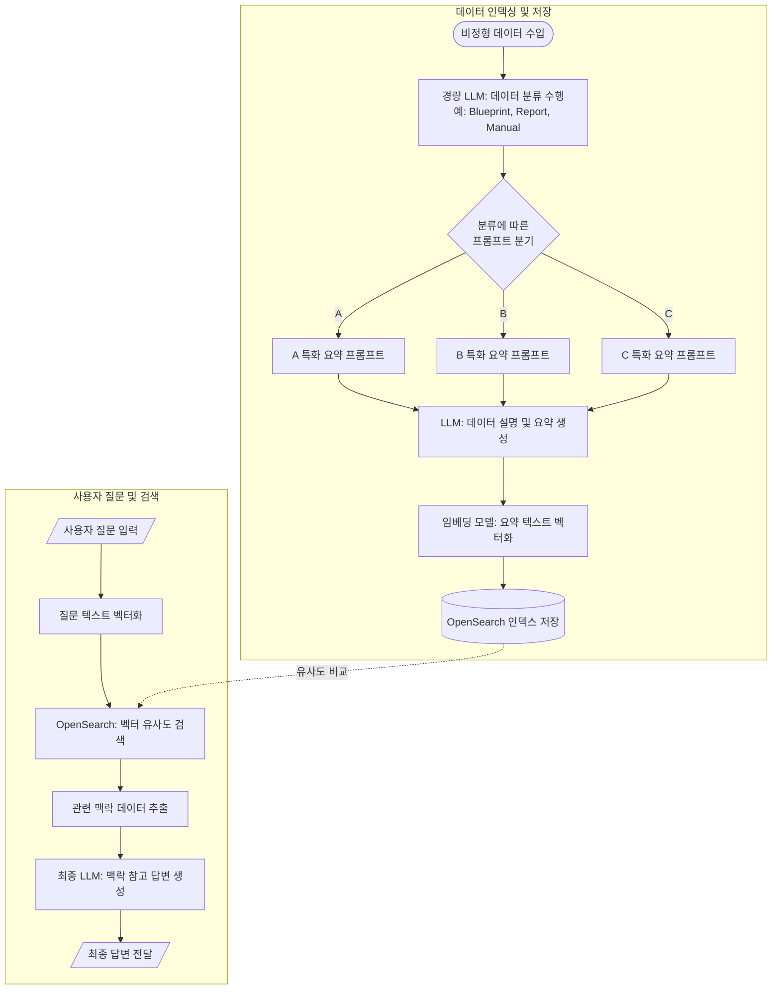

본 글은 최근에 검색 엔진을 개발하기 위한 과정에서 이전까지 가졌던 검색 엔진의 문제와, 또 이를 해결하기 위한 방법을 정리한 글입니다.
## OpenSearch
OpenSearch는 ElasticSearch에서 파생된 서비스로, AWS에서 제공하는 검색 엔진입니다.
OpenSearch를 처음 접할 때 가장 놀라운 점은 방대한 데이터 속에서도 0.n초 만에 원하는 결과를 찾아내는 속도입니다. 이 마법 같은 속도의 비밀은 바로 **역색인(Inverted Index)** 구조에 있습니다.


일반적인 책의 '목차'가 페이지 번호순으로 내용을 나열한다면, 역색인은 책 뒷부분의 **'찾아보기(Index)'** 와 같습니다. 데이터를 인덱싱하는 시점에 텍스트를 토큰화하고, 각 단어가 어떤 문서 ID에 위치하는지 미리 매핑해 두는 것이죠. 사용자가 검색어를 입력하면 OpenSearch는 문서를 일일이 뒤지는 대신, 이 이미 완성된 지도를 보고 정답이 적힌 페이지로 직행합니다.

## 비정형화된 데이터에서 문제 찾기
우리는 주로 흔히 일정한 JSON 포맷의 데이터를 인덱싱하는 환경에서부터 시작합니다. 규격화된 데이터는 처리가 쉽고 역색인을 통한 검색 효율도 가장 효율적이게 잘 검색할 수 있습니다. 하지만 실제 비즈니스 환경에서는 단지 텍스트 기반의 데이터만 있는 것이 아닌, 비정형 데이터들로 많이 이루어져 있습니다. 각종 PT 자료부터 시작해서 이미지와 같은 자료들이 수두룩합니다. 하지만 이렇게 데이터가 분산된 상태에서 이런 비정형 데이터를 찾기는 쉽지 않습니다. 

한번 생각해봅시다. 우리는 현재까지 strict하게 규격화된 데이터를 처리하고 있었습니다. 하지만 갑자기 서비스를 확장해야 할 필요성이 생기면서 우리는 정형 데이터 뿐만이 아닌 비정형 데이터를 다루게 되었습니다. 우리는 여기서 어떻게 해야 할까요? 

만약에 게임 사이트에서 검색 기능을 개발한다고 생각해 봅시다. 기존에 가지고 있던 각 document 들의 구성은 이렇다고 생각해 봅시다.
```
document_type : "item"
description_text : "아이템의 성능, 조합 아이템 목록, 사용 가능 직업 등"
```

하지만 갑자기 이미지도 검색할 수 있게 하고 싶다는 클라이언트의 요청이 들어옵니다.
```
document_type : "image"
description_text: ""
```
하지만 이런 맵 이미지 데이터는 기존에 가지고 있던 데이터가 없을 수 있습니다. 그렇다면 우리는 이런 문제를 어떻게 해결해야 할까요?

저는 가장 단순하게 생각 했었을 때, 검색에 대한 데이터와 일반 데이터를 분리하는 방법을 처음 생각했었습니다. `이미지를 OCR 처리해서 필요한 글자들만 가져온 다음, 이거를 검색어에 녹여낸 후, 검색 데이터에 추가해주면 되겠지` 라고 생각했었습니다. 물론 이러한 이미지가 문서를 캡쳐한 이미지와 같은 상황일 때는 해결책일 수 있습니다. 텍스트를 잘 구조화해서 뽑아낸다면 일반적인 텍스트 기반의 문서들과 같이 검색할 수 있으니까요. 하지만 만약에 어떤 도면과 같은 이미지에서는 어떨까요? 도면과 같은 이미지를 OCR하여 텍스트만을 추출한다고 하더라도 이 텍스트가 과연 의미가 있을 지에 대해서는 의문이 있습니다.

이러한 상황에서 데이터는 계속해서 쌓여가고, 기능적 요구사항은 계속해서 만족시켜야 하는 상황이기 때문에 우리는 계속해서 검색 방식에 대한 튜닝을 수동으로 조작하기도 하고, 유지 보수에도 큰 비용이 들어갑니다.

그렇다면 우리는 AI를 활용하여 이러한 문제를 어떻게 풀 수있을까요?
### ### 텍스트로 변환하는 방식(Lexical search)

정말 단순하게라면 이미지 내에 있는 텍스트라도 빼내서 이를 검색에 필요한 데이터로 인덱싱하면 되지만, 이 방법은 이미지에서 추출한 데이터가 의미 있을 거라는 보장도 없습니다. 그렇기에 우리는 해당 이미지에 대한 '정보'를 최대한 가져오는 것을 목표로 하는 방식이 있습니다.


만약 여러가지 사진과 글이 같이 있는 경우라면 정말 간단하게
1. 비정형 데이터를 처음에 받으면 이에 대해서 그대로 해당 자료에 대한 설명을 LLM에 태워 간단한 설명 등을 생성한다.
2. 이러한 비정형 데이터에 대해서 생성한 설명이나 요약에 대해서 임베딩 모델을 활용하여 텍스트 임베딩 벡터로 변환하여 OpenSearch 인덱스에 저장
3. 사용자가 텍스트로 질문하면 이를 벡터로 변환하여 관련 텍스트를 검색하고, 검색된 맥락을 LLM에 제공하여참고해서 LLM이 최종 답변을 생성할 수 있도록 함

정도로 생각할 수 있습니다.

하지만 이 방식에서는 비정형 데이터를 완벽하게 다룰 수 있기보다는 정보 손실의 위험성이 있다고 판단했습니다. AI는 확률로서 계산하는 것이지 완벽하게 이미지를 이해하는 것이 아니니까요

### 개선된 텍스트 변환 가정


이러한 문제를 풀기 위해 저는 보다 분류를 철저하게 하고 맞춤화된 프롬프트를 통해 이를 해결하는 방법을 생각했습니다.

1. 비정형 데이터를 처음에 받으면 이 자료가 현재 존재하는 자료 중에서 어떤 자료에 속하는지 경량 LLM 모델을 통해 분류(예를 들어, 게임 아바타 이미지를 넣었을 때 ‘avatar’)
2. 해당 분류된 종류에 따라 미리 만들어놓은 프롬프트들을 분기처리하여 LLM에게 다시 넘기고 해당 자료를 설명 할 수 있도록 함
3. 생성한 설명이나 요약에 대해서 임베딩 모델을 활용하여 텍스트 임베딩 벡터로 변환하여 OpenSearch 인덱스에 저장
4. 사용자가 텍스트로 질문하면 이를 벡터로 변환하여 관련 텍스트를 검색하고, 검색된 맥락을 LLM에 제공하여참고해서 LLM이 최종 답변을 생성할 수 있도록 함

이렇게 한다면 나중에 다른 종류의 문서를 추가해야 한다고 할 때, 해당 종류의 문서에 대한 프롬프트와 분류기준만 추가하면 다른 쪽의 로직을 고치지 않아도 확장이 가능합니다.
## 의미 기반 검색(Semantic search)
다른 방법으로는 의미 기반 검색이 있습니다.
의미 기반 검색은 우리가 원하는 데이터들을 정확하게 단어가 일치하지 않더라도, 문맥적인 의미가 같은 경우에 벡터 임베딩을 기반으로 검색해서 데이터들을 가져올 수 있게 되었습니다.


벡터 검색이 가능한 시맨틱 검색은 쿼리 파이프라인의 양쪽 끝에서 동시에 작업하여 결과를 생성합니다. 쿼리가 실행되면 검색 엔진은 쿼리를 데이터 및 관련 컨텍스트의 수치 표현인 임베딩으로 변환하고 이는 벡터에 저장됩니다. kNN 알고리즘, 즉 k-최근접 유사 항목(k-nearest neighbor) 알고리즘은 기존 문서의 벡터(텍스트에 관한 시맨틱 검색)를 쿼리 벡터와 일치시킵니다. 그러면 시맨틱 검색은 결과를 생성하고 개념적 관련성을 기반으로 순위를 매깁니다.

간단하게 플로우를 설명하자면 아래와 같이 이루어집니다.
1. 쿼리가 실행되면 검색 엔진은 쿼리를 데이터 및 관련 컨텍스트의 수치 표현인 임베딩으로 변환합니다. 이는 벡터에 저장됩니다.
2. [kNN 알고리즘](https://www.elastic.co/kr/what-is/knn), 즉 k-최근접 이웃 알고리즘은 기존 문서의 벡터(텍스트에 관한 시맨틱 검색)를 쿼리 벡터와 일치시킵니다.
3. 그러면 시맨틱 검색은 결과를 생성하고 개념적 관련성을 기반으로 순위를 매깁니다.
### 데이터의 본질을 수치로 포착하는 벡터 임베딩
그렇다면 이 벡터 임베딩이란 뭘까요? 

시맨틱 검색이 단순한 키워드 매칭을 넘어 문맥을 이해할 수 있는 이유는, 모든 데이터를 **'벡터 임베딩(Vector Embeddings)'** 이라는 고차원의 수치 데이터로 변환하여 처리하기 때문입니다.

**벡터 임베딩**이란 텍스트, 이미지, 오디오와 같은 비정형 데이터를 딥러닝 모델(LLM 등)을 통해 수백 또는 수천 개의 차원을 가진 연속적인 벡터 공간상의 좌표로 투영하는 과정을 의미합니다. 쉽게 비유하자면, 세상의 모든 정보에 대해 '달콤함', '무게', '가격', '계절성' 등 수천 가지의 기준(차원)으로 점수를 매겨 거대한 다차원 지도 위에 점을 찍는 것과 같습니다.

기술적으로 볼 때, 임베딩의 핵심은 **'의미적 보존'** 에 있습니다. 자연어 처리(NLP) 모델은 방대한 데이터를 학습하며 단어와 문장 사이의 통계적 관계를 파악합니다. 이 과정을 거친 임베딩 벡터는 단순한 숫자의 나열이 아니라, 데이터의 핵심 특징(Feature)을 압축한 결과물이 됩니다. 예를 들어 '왕'과 '남자'의 관계는 벡터 공간 내에서 '여왕'과 '여자'의 관계와 유사한 방향성과 거리를 갖게 됩니다. 이를 통해 컴퓨터는 인간이 사용하는 언어의 미묘한 뉘앙스와 맥락적 유사성을 수학적으로 계산 가능한 상태로 받아들입니다.

결국 쿼리가 실행되면, 검색 엔진은 사용자의 질문을 즉석에서 동일한 차원의 **쿼리 벡터**로 변환합니다. 이때 미리 색인(Indexing)되어 있던 문서 벡터들과의 **코사인 유사도(Cosine Similarity)** 나 **유클리드 거리(L2 Distance)** 등을 계산하게 됩니다. 앞서 언급한 kNN(k-최근접 이웃) 알고리즘이 바로 이 고차원 지도 위에서 쿼리 좌표와 가장 물리적으로 가까운 위치에 있는 데이터들을 추출해내는 역할을 수행하는 것입니다.

결과적으로 벡터 임베딩은 검색 엔진에게 '글자의 형태'가 아닌 '개념의 본질'을 가르치는 일종의 번역기 역할을 하며, 이를 통해 우리는 오타가 있거나 다른 단어를 사용하더라도 의도에 딱 맞는 정보를 찾을 수 있게 됩니다.

>더 자세히 알고 싶다면 [해당 링크](https://www.youtube.com/watch?v=g38aoGttLhI) 를 통해 llm의 원리, 그리고 임베딩에 대해 잘 설명한 영상으로 이해할 수 있습니다.

### ### 이미지 자체를 텍스트와 같은 벡터 공간에 넣기(multimodal embedding processor)

OpenSearch의 neural Search는 기존의 벡터 검색이 이미 만들어진 벡터를 저장하고 검색하는 데 집중했던 문제를 해결하고자 **텍스트를 주면 알아서 모델을 돌려 벡터로 만들고 검색까지 한 번에** 처리해줌

|**구분**|**일반적인 벡터 검색 (k-NN)**|**Neural Search**|
|---|---|---|
|**임베딩 위치**|애플리케이션 서버 (외부)|**OpenSearch 내부** (ML Commons)|
|**데이터 수집 시**|개발자가 직접 벡터로 변환해서 입력|텍스트만 넣으면 **알아서 벡터화**해서 저장|
|**검색 시**|질문을 직접 벡터화해서 쿼리 날림|질문(텍스트)만 던지면 **알아서 검색**|
|**복잡도**|복잡함 (외부 AI 연동 로직 필요)|**매우 단순함**|


> [Opensearch에서 제공하는 Docs에서는 해당과 같이 설명되어 있습니다.](https://docs.opensearch.org/latest/ingest-pipelines/processors/text-image-embedding/)

AWS에서 제공하는 Titan Multimodal Embedding 모델을 쓰면 이미지와 텍스트 모두 하나의 벡터에 담고 이를 기반으로 검색할 수 있는 것이죠. 그렇게 된다면 이미지 자체가 하나의 의미를 가지고 검색함으로써 비슷한 맥락에서의 거리 기반 검색을 통해서 유사도 높은 이미지 검색을 이루어낼 수 있습니다. 

### Hybrid Search


hybrid search는 키워드 기반 검색과 의미 기반 검색의 장점들을 활용해서 검색의 퀄리티를 높이는 방법입니다.


- **Lexical Search** : OpenSearch와 같은 전통적인 검색 엔진에서 주로 사용되는 방법으로, BM25와 같은 희소 벡터 알고리즘을 통해 키워드 기반 매칭을 진행한다. 특정 도메인 용어를 검색하기에 용이하지만 오타 및 동의어에 취약하다.
- **Semantic Search** : 키워드가 일치하지 않더라도 의미론적으로 유사한 검색 결과를 반환한다. 검색 결과는 임베딩 품질에 의존도가 높다.

**Hybrid Search**는 각 검색 방법의 장점만을 추려 사용된다. 특정 도메인 용어나 제품 용어가 포함된 쿼리로 검색했을 때도 Lexical Search의 검색 결과를 통해 보조한다. 의미론적으로 유사한 동의어 검색의 경우 및 오타가 일부 포함되더라도 Semantic Search가 벡터 기반으로 가장 가까운 내용을 반환하기 때문에 보다 정확도를 높일 수 있습니다.

이와 같이 기존에는 해결하기 어려웠던 검색엔진에 대한 문제를 LLM을 이용하여 풀어내면서 점점 기술은 발전되고 있습니다. 아직도 이러한 검색 방법에 대한 논문은 RAG가 발전함에 따라 끊임없이 나오고 있는 상황이고요.
이러한 방법들을 정리하면서 이제는 AI를 활용하여 기존에는 풀 수 없는 문제들을 세상은 하나씩 풀어가고 있다는 실감이 납니다. 앞으로 우리는 어떤 문제들을 발견해내고 해결해야 할 지에 대한 고민을 더 해봐야 할 것 같습니다.