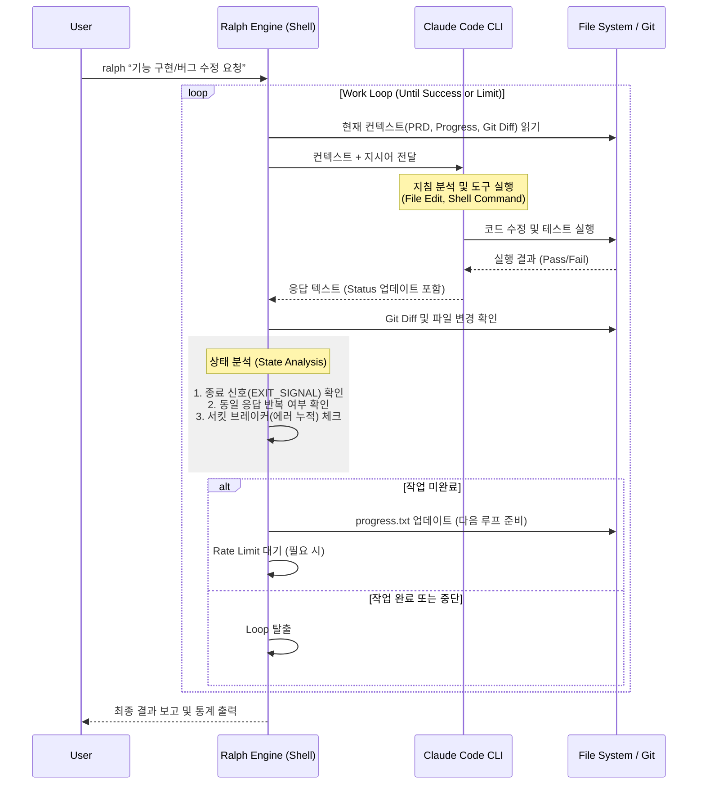

개인적으로 저는 심슨을 매우 좋아합니다.
제가 대학을 영문과로 진학한 이유도 초등학교 때부터 심슨을 보면서 자라왔고, 심슨을 통해 미국 문화에 대해 관심을 가지기 시작하면서 영어에도 관심이 많아져 진학했습니다.

그 중에서도 제가 가장 좋아하는 캐릭터는 단연코 랄프였습니다.


어딘가 나사가 하나 빠져있는 듯한 행동을 하는 랄프는 마치 신입인 저 같달까요...

그런데 작년부터 이 랄프의 이름을 딴 claude code의 플러그인이 갑자기 성행하기 시작했습니다.


오늘은 이 ralph claude code 오픈소스의 철학과 그 원리에 대해서 탐구해보고자 합니다.


### 반복을 통한 개선
심슨의 Ralph wiggum이라는 캐릭터는 위에서 말한 대로 어딘가 나사 하나가 빠져 엉뚱한 행동이나 말을 하는 친구입니다. 


그래서 그런지 이런 짤들도 많죠.

Geoff Huntley가 이 Ralph의 이름을 따서 제안한 철학은 wiggum의 행동과 비슷합니다.
처음의 랄프라면 놀이터를 만들 때 미끄럼틀을 만들고 반대쪽으로 점프해서 내려올 겁니다. 하지만 떨어진 이후에는 '미끄럼틀을 타세요' 라는 표지판을 붙여놓을 겁니다. 그리고 미끄럼틀에서 다시 점프해서 떨어진다면 '미끄럼틀에 앉아서 내려가세요'라는 표지판을 붙이겠죠.

이렇듯 랄프는 처음에 결함이 많았지만, 시도를 반복해 가면서 조금씩 더 나아집니다. ralph 철학은 이렇듯 처음에는 엉뚱하고 AI가 할루시네이션을 일으킨다던가 엉뚱한 코드를 만들어내는 행위가 지속되지 않고 스스로 처음에 요구했던 요구사항들을 결정적으로 만들어내기 위한 시스템 아키텍처입니다. 

### 기본적인 아키텍처
랄프의 아키텍처는 다른 복잡성이 큰 AI Agent보다 훨씬 단순하게 되어 있습니다. 다중 에이전트를 사용하는 경우에 이 마이크로서비스(에이전트) 자체가 비결정적이라면 결국 결과는 좋지 않을 것이기 때문입니다. 랄프는 모놀리식 애플리케이션의 구조를 채택해 단일 프로세서가 수직적으로 확장되는 구조입니다. 그리고 한 번의 루프를 도는 동안 하나의 작업에만 집중합니다.


보시면 각 phase마다 해당 phase에 맞는 요구사항 정리, Todo List, 구현의 작업을 맡아 하나의 작업을 주로 처리하고, 해당 작업에서 순차적으로 에이전트를 호출함으로써 구현하고 있습니다 
### 최소 상태의 법칙

랄프에서 강조하는 것 중 핵심 중 하나는 **'모든 루프에서 스택을 동일한 방식으로 결정적으로 할당'** 하는 것입니다. 
매 루프마다 스택에 필요한 계획과 스펙을 할당합니다. 

이 과정에서 매 루프마다 컨텍스트는 초기화되고 필요한 상태만 파일로부터 다시 주입합니다. Context window는 AI에서 많은 개발자들이 최대한 많이 담으려 하지만 결국 많은 콘텍스트는 에이전트를 더 헷갈리게 하는 것이라고 Geoff Huntley는 말했습니다.

따라서 Ralph는 **상태 없음(Stateless)을 지향**합니다. 즉, AI가 하나의 작은 작업을 완료할 때마다 이전의 대화 내역을 모두 삭제하고, 오직 현재 작업에 필요한 핵심 파일과 최신 상태의 명세서(Spec)만을 로드하여 **완전히 새로운 컨텍스트**에서 작업을 시작하는 것이죠.

---

### Backpressure


랄프 철학에서 두 번째 핵심은 앞에서도 말했듯 '표지판'을 세우는 과정인 Backpressure입니다. 바퀴가 빠르게 돌되, 정확성의 축과 균형을 맞춰야 한다는 것입니다.

Ralph가 자율적으로 돌 수 있는 이유는 스스로 틀렸다는 것을 알 수 있기 때문입니다. 이를 위해 검증 계층을 순서대로 쌓습니다.

| 계층        | 도구 예시                               | 역할           |
| --------- | ----------------------------------- | ------------ |
| 1. 타입 시스템 | TypeScript, Rust                    | 컴파일 시점 오류 포착 |
| 2. 정적 분석기 | Dialyzer (Elixir), Pyrefly (Python) | 런타임 전 문제 탐지  |
| 3. 테스트    | 각 언어의 단위테스트 및 통합테스트 등 프레임워크         | 동작 검증        |
| 4. 보안 스캐너 | 취약점 스캐너                             | 보안 이슈 포착     |

이 계층들이 모두 통과되어야만 루프가 다음 작업으로 넘어갑니다. 에이전트가 아무리 “완료했다”고 말해도, 컴파일러와 테스트가 통과하지 않으면 완료가 아닙니다.

여기서 테스트에는 중요한 규칙이 하나 추가됩니다. **”왜 이 테스트가 중요한가”를 반드시 문서화**해야 합니다.
```text
“””
데이터베이스 쿼리 옵티마이저 테스트.
이 테스트들은 캐싱과 배치 기능이 올바르게 동작하는지 검증합니다.
캐시 히트율이 90% 이하로 떨어지면 성능 회귀를 의미합니다.
“””
```

앞에서도 말했듯 무상태성을 가진 랄프는 다음 루프에서 이전 루프의 대화를 기억하지 못하기 때문에 테스트의 이유를 남겨두지 않으면 다음 에이전트가 그 테스트를 불필요하다고 판단하고 지워버릴 수 있습니다.

이와 함께 계속해서 테스트와 다양한 정적 타입 분석 등을 통해 랄프가 가는 길을 계속해서 명확하게 해 나가는 것이 중요한 랄프의 핵심입니다.

---

### 그래서 어떻게 하는건데?

Ralph의 핵심 코드는 한 줄입니다.

```bash
while :; do cat PROMPT.md | claude-code ; done
```

이게 전부입니다. 단순 bash loop로 되어 있죠. `PROMPT.md`에 현재 컨텍스트 파일들을 참조해두면, 루프가 돌 때마다 Claude Code가 이를 읽고 다음 작업을 판단해 처리합니다.



Ralph(Shell)는 단순한 조율자입니다. 실제 판단과 구현은 Claude Code가 합니다. Ralph는 컨텍스트를 전달하고, 결과를 확인하고, 루프를 반복할 뿐입니다.

---

### 핵심 파일들

Ralph가 매 루프마다 로드하는 파일은 정해져 있습니다.

| 파일 | 역할 |
|---|---|
| `@AGENT.md` | 빌드/실행/테스트 명령어 지침 |
| `@fix_plan.md` | 현재 작업 계획, 발견된 버그 목록 |
| `@specs/*` | 기능 명세서들 |

이 세 파일이 Ralph의 단기 기억입니다. 루프가 끝나면 컨텍스트는 초기화되지만 이 파일들은 남습니다. 에이전트가 새로운 사실을 발견하면 `@AGENT.md`나 `@fix_plan.md`를 직접 업데이트해 다음 루프에 전달합니다.

Ralph는 이런 식으로 무한히 이어지는 장기 프로젝트를 처리합니다. 컨텍스트 윈도우 한계를 파일 시스템으로 우회하는 것이죠. 단순하게만 보일 수도 있겠지만 기존 AI Agent의 한계를 잘 파악하고 이를 시스템적으로 보완한 좋은 사례라고 생각합니다. 
### 단순함을 강점으로

심슨의 랄프는 종종 엉뚱한 말을 합니다. 그런데 그 엉뚱함이 때로는 가장 핵심을 찌르기도 합니다.

Ralph-claude-code도 비슷합니다. “그냥 while 루프잖아?”라고 생각할 수 있습니다. 맞습니다. 하지만 그 단순함이 오히려 강점이죠. 코드를 읽을 수 있고, 디버깅할 수 있고, 믿을 수 있습니다. 복잡한 블랙 박스의 AI 오케스트레이션보다 투명한 랄프가 훨씬 강력하게 작용할 수 있습니다.

### 마치며.. but maintainability?
Geoff Huntley가 쓴 글의 마지막 부분에는 이러한 문단이 있었습니다.

“AI가 만든 코드는 유지보수가 안 되지 않나요?”

이 질문을 들을 때마다 Geoff Huntley는 반문합니다. **”누가 유지보수하는 건가요?”**

>인간이 유지보수의 기준이어야 할 이유가 있을까요? 코드가 이해하기 어렵다면, AI에게 루프를 돌려서 리팩토링하면 됩니다. 버그가 생기면, 루프를 다시 돌려서 고치면 됩니다. 요구사항이 바뀌면, 스펙을 업데이트하고 루프를 돌리면 됩니다.

AI 시대에 접어들면서 “유지보수하기 좋은 코드”에 대한 정의도 점점 기존의 정의가 아닌 다르게 정의를 내리려는 시도들이 보입니다. 좋은 코드란 인간이 읽기 좋은 코드가 아니라, **AI가 다음 루프에서 올바르게 이해하고 개선할 수 있는 코드**일 수도 있다는 의견은 AI가 대부분의 코드를 짜는 지금 당장도 무시할 수 없는 의견이기도 합니다.

저 또한 계속해서 앞으로의 프로그래밍의 방향에 대해서 고민하면서 '유지보수하기 좋은 코드'에 대한 고민을 많이 합니다. 처음에는 **인간이 유지보수하기 좋은 코드여야 예외의 상황에서 안정성있게 서비스할 수 있다**라는 의견이었지만 사실 결국 인간이 유지보수하더라도 비결정적인 특성은 같다고 생각합니다. 그렇기에 요즘에는 그 인간과 AI 모두 잘 이해할 수 있도록 균형이 맞춰진 코드를 만들어나가는 것이 중요하다고 생각하는데요, 앞으로는 또 어떻게 될지 모르겠습니다. 이 질문은 계속해서 개발자들이 해나가야 할 질문이 아닐까 생각합니다. 여러분들도 한번 이 주제에 대해서 생각해보시기를 바라며 글을 마칩니다. 

### 참조
https://ghuntley.com/ralph/
https://discuss.pytorch.kr/t/ralph-playbook-ralph/8705
[https://github.com/frankbria/ralph-claude-code?tab=readme-ov-file](https://github.com/frankbria/ralph-claude-code)
