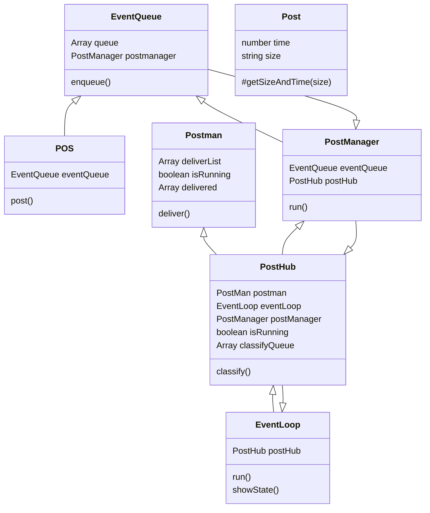

# 나만의 체크포인트
## 문제 1
- [x] 분석 및 설계 ✅ 2024-07-29
- [x] EventQueue 클래스 설계 및 구현 ✅ 2024-07-29
- [x] EventManager 클래스 설계 및 구현 ✅ 2024-07-29
- [x] EventLoop 클래스 설계 및 구현 ✅ 2024-07-29
- [x] Post 클래스 설계 및 구현 ✅ 2024-07-29
- [x] PostMan 클래스 설계 및 구현 ✅ 2024-07-29
- [x] PostHub 클래스 설계 및 구현 ✅ 2024-07-29
## 문제 2
- [x] 분석 및 설계 ✅ 2024-07-29
- [x] EventQueue 클래스 설계 및 구현 ✅ 2024-07-29
- [x] EventManager 클래스 설계 및 구현 ✅ 2024-07-29
- [x] EventLoop 클래스 설계 및 구현 ✅ 2024-07-29
- [x] Post 클래스 설계 및 구현 ✅ 2024-07-29
- [x] PostMan 클래스 설계 및 구현 ✅ 2024-07-29
- [x] PostHub 클래스 설계 및 구현 ✅ 2024-07-29
- [x] 입력 받기 ✅ 2024-07-30
- [ ] 배달원 스케줄링
# 문제해결과정
## 분석 및 설계
### 동작 흐름


우선 내가 생각하는 동작의 흐름은 이와 같다.
1. POS를 통해 택배 정보를 Event queue(POS 접수 대기 큐)에 enqueue한다.
2. POS 접수 대기 큐의 배송 목록은 배송 매니저가 주기적으로 큐를 확인한 뒤 만약 큐에 대기목록이 있다면 물류센터로 보냄
3. 이벤트 루프는 주기적으로 돌면서 계속해서 물류센터에 전달된 물품 이벤트가 있는지 확인하고, 물류센터 큐의 분류 대기 상태가 될 때까지 기다렸다가 대기상태가 되면 물류센터 큐로 물류를 보낸다.
4. 물류센터의 물류와 배송원의 상태를 boolean값으로 두고, 동작이 가능한 상태인지 확인하면서 동작이 가능할 경우 쌓여있던 이벤트를 하나씩 보냄

여기서 배달 기사나 물류센터 직원의 경우 한 번에 1개의 물품만 배달할 수 있는데, 1번의 경우에는 배달기사가 1명이라는 가정 하에 해야 하므로 기존 배달이 완료되기까지 대기한 후에 다음 배달을 출발해야 한다.
### 객체 연관 설계


이렇게 일단 설계를 하고 시작해보려 한다.

## 객체 구현
### POS 클래스
```js
const { EventQueue } = require("./eventQueue");

class POS {
  constructor() {
    this.eventQueue = new EventQueue();
  }
  post(size, count) {
    this.eventQueue.enqueue(size, count);
  }
}
```
POS객체는 처음 주문을 받고 eventQueue로 해당 주문을 넘겨준다.
### EventQueue 클래스
```js
const { Post } = require("./post");
const { PostManager } = require("./postManager");

class EventQueue {
  static instance;
  constructor() {
    if (EventQueue.instance) return EventQueue.instance;
    this.queue = [];
    this.postManager = new PostManager(this);
    EventQueue.instance = this;
  }
  enqueue(size, count) {
    for (let i = 0; i < count; i++) {
      this.queue.push(new Post(size));
    }
    this.postManager.postHub.fullpost += count;
  }
}

module.exports = { EventQueue };

```
이렇게  EventQueue 클래스의 enqueue 메소드를 통해서 해당 대기 배송 목록에 들어가게 되고, 이러한 대기 배송의 목록의 경우에는 PostManager클래스가 주기적으로 봐주면서 관리하게 된다.
### PostManager 클래스
```js
const { Runable } = require("./abstractClass");
const { EventQueue } = require("./eventQueue");
const { PostHub } = require("./postHub");

class PostManager extends Runable {
  constructor(eventQueue) {
    super();
    this.eventQueue = eventQueue;
    this.postHub = new PostHub(this);
    this.run();
  }

  run() {
    setInterval(() => {
      if (this.eventQueue.queue.length) {
        this.postHub.classifyQueue = this.postHub.classifyQueue.concat([
          ...this.eventQueue.queue,
          "show",
        ]);
        this.eventQueue.queue = [];
      }
    }, 3000);
  }
}

module.exports = { PostManager };

```
PostManager 클래스에서는 run() 메소드를 통해서 `setInterval()`을 실행시켜 주기적으로 목록을 보고 물류창고인 PostHub로 넘겨준다.
### PostHub 클래스
```js
const { Runable } = require("./abstractClass");
const { EventLoop } = require("./eventLoop");
const { Post } = require("./post");
const { Postman } = require("./postman");

class PostHub extends Runable {
  constructor(postManager) {
    super();
    this.postMan = new Postman();
    this.postManager = postManager;
    this.classifyQueue = [];
    this.isRunning = false;
    this.eventLoop = new EventLoop(this);
    this.fullpost = 0;
  }

  classify(post) {
    this.isRunning = true;
    console.log(`${post.size} 분류 시작`);
    setTimeout(() => {
      console.log(`${post.size} 분류 완료`);
      this.postMan.deliverList.push(post);
      this.isRunning = false;
    }, post.time);
  }
}

module.exports = { PostHub };

```
이렇게 만들어진 PostHub에서는 eventLoop 객체를 만들어 실행시키게 되는데, eventLoop문에서 classify를 실행시켜 분류를 해당 객체 내에서 진행하는 방식이다. 
비동기 방식을 사용하기 위해 setTimeout을 통해서 물류에 해당하는 시간만큼, 후에 완료되도록 하고, 이러한 한 작업자의 상태는 boolean값으로 관리하여 해당 작업자의 상태를 보고 분류를 실행시킨다.
### EventLoop 클래스

```js
const { Runable } = require("./abstractClass");

class EventLoop extends Runable {
  constructor(postHub) {
    super();
    this.postHub = postHub;
    this.run();
  }

  async run() {
    const running = setInterval(() => {
      if (!this.postHub.isRunning && this.postHub.classifyQueue.length) {
        const post = this.postHub.classifyQueue.shift();
        if (post === "show") this.showState();
        else this.postHub.classify(post);
      }
      if (
        !this.postHub.postMan.isRunning &&
        this.postHub.postMan.deliverList.length
      ) {
        const deliver = this.postHub.postMan.deliverList.shift();
        this.postHub.postMan.deliver(deliver);
      }
      if (this.postHub.fullpost === this.postHub.postMan.delivered.length) {
        console.log("모든 배송이 완료되었습니다.");
        process.exit();
      }
    }, 1000);
  }
  showState() {
    console.log(
      `대기중:${this.postHub.postManager.eventQueue.queue.join(
        ","
      )}/ 분류중: ${this.postHub.classifyQueue.join(
        ","
      )}/ 배송중:${this.postHub.postMan.deliverList
        .map((item) => item.size)
        .join(",")}/ 배송완료: ${this.postHub.postMan.delivered
        .map((item) => item.size)
        .join(",")}`
    );
  }
}

module.exports = { EventLoop };
```
EventLoop클래스에서도 주기적으로 setInterval을 통해서 주기적으로 물류 센터에 남아 있는 물류와 작업자의 상태를 보고 분류를 실행하고, 배송원의 경우에도 똑같은 방식으로 배송원의 상태와 배달 목록을 보고 배달을 처리해나갈 수 있도록 실행하는 조건문을 걸어주었다.
만약 현황이 안에 들어가있을 경우를 고려하여 showState라는 메서드를 해당 객체에 만들어주고, PostManager가 보낸 show라는 이벤트를 따로 구별하여 메서드를 실행할 수 있도록 해주었다.

### Post클래스
```js
class Post {
  constructor(size) {
    [this.time, this.size] = this.#getSizeAndTime(size);
  }
  #getSizeAndTime(size) {
    let time;
    let sizeName;
    switch (size) {
      case 1:
        time = 3000;
        sizeName = "소형";
        break;
      case 2:
        time = 7000;
        sizeName = "중형";
        break;
      case 3:
        time = 15000;
        sizeName = "대형";
        break;
      default:
        time = 0;
        sizeName = "";
        break;
    }
    return [time, sizeName];
  }
}

module.exports = { Post };


```
Post 클래스의 경우 각 배송 물류에 대한 사이즈를 한글로 받아야 하기 때문에 객체로 만들어서 관리할 수 있도록 하였다.

### EventQueue 클래스
```js
class EventQueue {
  static #instance;
  constructor() {
    if (EventQueue.#instance) return EventQueue.#instance;
    this.queue = [];
    this.eventLoop;
  }
  enqueue(size, count) {
    for (let i = 0; i < count; i++) {
      this.queue.push(size);
    }
  }
  dequeue() {}
}

module.exports = { EventQueue };

```
EventQueue는 evenloop와 종속관계에 있다. 이벤트 루프 또한 싱글 톤으로 구현하며 이를 EventQueue 내에서 eventloop의 메서드를 계속해서 실행시키며 무한루프를 구현하기 때문이다.

# 문제 2 설계하기


문제 2에서는 물류센터가 4개라고 가정하고 그 안의 배달원과 분류원을 유동적으로 조절할 수 있다.
또한 EventEmitter의 추가로 분류원/배송원/입력 등의 행위에서 각 이벤트를 내보내어 EventEmitter로 처리해야 하고, Promise의 사용으로 비동기를 지원할 수 있어야 한다.
따라서 이런 모양으로 설계해봤는데, 정답. 북두칠성!
이런 식의 비동계 설계는 처음이라 너무 골아프다

골아파서 고라파덕

## PostMan 클래스
```js
const { Runable } = require("./abstractClass");
const { emitter } = require("./eventEmitter");

class Postman {
  constructor(id, hub) {
    this.delivering = false;
    this.id = id;
    this.hub = hub;
  }

  deliver(post) {
    return new Promise((resolve, reject) => {
      emitter.emit("deliverStart", this, post);
      resolve(
        setTimeout(() => {
          emitter.emit("deliverFinish", this, post);
        }, 10000)
      );
    });
  }
}

module.exports = { Postman };

```
가장 크게 변한건 배송원과 분류원의 로직이다. 배송원/분류원의 경우 여러명이 있기 때문에 각 인원에 대해서 배열로 관리해야 할 필요성을 느꼈다.
또한 Promise를 사용하여 비동기 처리를 해야 했는데, 이제까지는 settimeout의 콜백에 resolve를 두고 한참 고민했는데 생각해보니 밖으로 뺀 다음에 해당 직원들의 상태를 공유할 수 있는 속성을 두고 따로 관리하면 됐다. 이러한 부분은 emitter를 통해 관리해주었다.

## Hubworker 클래스
```js
const { emitter } = require("./eventEmitter");

class HubWorker {
  constructor(hub, id) {
    this.id = id;
    this.working = false;
    this.hub = hub;
  }
  classify(post1, post2) {
    let time = post1.time;
    if (post2) {
      time = post1.time > post2.time ? post1.time : post2.time;
    }
    emitter.emit("classifyStart", this, post1, post2);
    return new Promise((resolve, reject) => {
      resolve(
        setTimeout(() => {
          emitter.emit("classified", this, post1, post2);
        }, time)
      );
    });
  }
}

module.exports = { HubWorker };

```
각 분류원도 인원마다 관리를 해주어야 했기 때문에 따로 클래스 객체를 만들어 관리할 수 있도록 해주었다. 여기서 특이한 점은 한 직원당 두 개의 택배를 관리할 수 있기 때문에 한개만 남았을 경우나 두 개의 택배가 들어올 경우를 조건문을 통해 따로 처리해주었다.
## EventLoop 클래스
```js
const { Runable } = require("./abstractClass");

class EventLoop extends Runable {
  constructor(postHub) {
    super();
    this.postHub = postHub;
    this.run();
  }

  async run() {
    const running = setInterval(() => {
      this.#letsWorkHub();
      this.#letsWorkPostman();
    }, 1000);
  }

  #letsWorkHub() {
    while (this.postHub.classifyQueue.length) {
      let addedWork;
      if (this.postHub.classifyQueue.length >= 2) {
        addedWork = this.postHub.classifyQueue.shift();
      }
      const worker = this.#findHubWorker();
      if (worker)
        worker.classify(this.postHub.classifyQueue.shift(), addedWork);
      else return;
    }
  }
  #letsWorkPostman() {
    while (this.postHub.postToDeliver.length) {
      const postman = this.#findPostMan();
      if (postman) postman.deliver(this.postHub.postToDeliver.shift());
      else return;
    }
  }

  #findHubWorker() {
    for (const worker of this.postHub.hubWorker) {
      if (!worker.working) return worker;
    }
    return false;
  }
  #findPostMan() {
    for (const worker of this.postHub.postMan) {
      if (!worker.delivering) return worker;
    }
    return false;
  }
  showState() {}
}

module.exports = { EventLoop };

```
EventLooP는 기존과는 비슷한 방식으로 동작하지만, 여기서 추가된 점은 여러 명의 직원들이 있을 경우에 가능한 직원을 뽑아 해당하는 일을 맡겨야 했다. 이러한 부분을 고려해서 Property에 추가해놓은 상태 boolean 값을 활용하여 현재 일하고 있지 않은 직원을 찾아 해당 직원에게 일을 할당하도록 했다.

### Posthub 클래스
```js
const { emitter } = require("./eventEmitter");
const { EventLoop } = require("./eventLoop");
const { HubWorker } = require("./hubWorker");
const { Post } = require("./post");
const { Postman } = require("./postman");

class PostHub {
  constructor(postManager, hubWorker, postMen, id) {
    this.postMan = Array.from(
      { length: postMen },
      (_, idx) => new Postman(idx, this)
    );
    this.postToDeliver = [];
    this.postManager = postManager;
    this.hubWorker = Array.from(
      { length: hubWorker },
      (_, idx) => new HubWorker(this, idx)
    );
    this.classifyQueue = [];
    this.eventLoop = new EventLoop(this);
    this.id = id;
  }
}

module.exports = { PostHub };

```
기존에는 PostHub 클래스 안에 분류하는 메서드를 놓았지만, 이를 따로 Hubworker 클래스의 인스턴스들의 메서드로 들어가면서 해당 물류센터에서 필요한 메서드를 따로 필요없다고 생각하여 모조리 빼버렸다.
## EventEmitter 클래스
```js
const EventEmmiter = require("events");
class PostEventEmmiter extends EventEmmiter {}

const emitter = new PostEventEmmiter();
emitter.on("recept", (postManager, count) => {
  postManager.sendToHub();
  postManager.fullPosts += count;
});

emitter.on("classifyStart", (worker, post1, post2) => {
  console.log(
    `물류센터${worker.hub.id}의 작업자${worker.id}-${post1.sender}${post1.size} 분류시작`
  );
  if (post2)
    console.log(
      `물류센터${worker.hub.id}의 작업자${worker.id}-${post2.sender}${post2.size} 분류시작`
    );
  worker.working = true;
});
emitter.on("classified", (worker, post1, post2) => {
  console.log(
    `물류센터${worker.hub.id}의 작업자${worker.id}-${post1.sender}${post1.size} 분류종료`
  );
  if (post2)
    console.log(
      `물류센터${worker.hub.id}의 작업자${worker.id}-${post2.sender}${post2.size} 분류종료`
    );
  worker.hub.postToDeliver.push(post1);
  if (post2) worker.hub.postToDeliver.push(post2);
  worker.working = false;
});

emitter.on("deliverStart", (postMan, post) => {
  postMan.delivering = true;
  console.log(
    `물류센터${postMan.hub.id}의 배달기사${postMan.id}-고객${post.sender}${post.size}배달시작`
  );
});
emitter.on("deliverFinish", (postMan, post) => {
  postMan.delivering = false;
  console.log(
    `물류센터${postMan.hub.id}의 배달기사${postMan.id}-고객${post.sender}${post.size}배달완료`
  );
  postMan.hub.postManager.delivered++;
  console.log(
    postMan.hub.postManager.delivered,
    postMan.hub.postManager.fullPosts
  );
  if (postMan.hub.postManager.delivered === postMan.hub.postManager.fullPosts) {
    console.log("모든 물품이 배달되었습니다.");
    process.exit();
  }
});

module.exports = { emitter };

```
EventEmitter의 경우에는 그냥 상속을 통해 기존 이벤트에미터를 상속받고, 내 인스턴스를 만든 다음 해당하는 이벤트를 모조리 한 곳에서 등록시켜주고 사용했다. 
요구사항에 나와있는대로 각 작업이 시작하거나 끝날 때마다의 이벤트를 각각 등록해주어 해당하는 직원의활동 상태를 변경하거나 콘솔로 찍는 로직들로 이루어져 있다,.
나는 여기서 종료 조건을 걸었는데, EventEmitter가 배달이 완료됐을 때에서 이벤트를 발생시켜야 한대서 왜 그럴까 생각을 해봤는데 이제까지 배달한 횟수와 처음에 받았던 모든 택배들의 수를 따로 postManager에서 관리하여 준다면 종료 조건을 따로 만들 수 있기 때문이라고 생각했다. 이에 여기서 배달이 완료될 때마다 현황을 갱신하여 배달한 물품 개수와 총 개수가 같으면 프로그램을 종료하도록 했다.
## PostManager 클래스
```js
const { emitter } = require("./eventEmitter");
const { PostHub } = require("./postHub");

class PostManager {
  constructor(eventQueue, hubWorker, postMen) {
    this.eventQueue = eventQueue;
    this.postHub = Array.from(
      { length: 4 },
      (_, idx) => new PostHub(this, hubWorker, postMen, idx)
    );
    this.fullPosts = 0;
    this.delivered = 0;
  }

  sendToHub() {
    if (this.eventQueue.queue.length) {
      this.postHub.sort(
        (hub1, hub2) => hub1.classifyQueue.length - hub2.classifyQueue.length
      );
      this.postHub[0].classifyQueue = this.postHub[0].classifyQueue.concat(
        this.eventQueue.queue
      );
      this.eventQueue.queue = [];
    }
  }
}

module.exports = { PostManager };

```
기존 PostManager은 여기서 setInterval을 통해 주기적으로 큐에 있는 pos의 요청들을 가져왔다면, 여기서는 sendToHub라는 메소드로 바꿔 eventemitter를 통해서 실행시킬 수 있도록 하였다.
## 결과


# 학습메모
https://luxurious-share-af6.notion.site/Day11-f2a66dd0e7ef45c8bea1e157e37a0998?pvs=4
자세한 것은 학습 메모를,,,


# 개선
## 구조적 측면

- [x] Runable 상속 빼기 ✅ 2024-07-30
- [x] Emitter를 클래스마다 상속 ✅ 2024-07-30
- [x] 메서드가 아닌 이벤트를 전달하는 방식으로 리팩토링 ✅ 2024-07-30
- [x] 배송원마다 전담하는 품목 설정 ✅ 2024-07-30
- [x] dashboard 클래스 만들어서 현황 관리 ✅ 2024-07-30
- [ ] main split해서 받는 입력 부분 정규표현식으로 바꾸기 
- [ ] 여러개 입력 받을 수 있도록 설정
- [ ] 입력한 후에 물류센터나 배송 처리 중에도 다시 입력을 받을 수 있게끔 설정

## 기능적 측면

- [ ] 작업자가 여러개
- [ ] POS 여러개 두기
- [ ] 배송기사가 여러개의 물품 배송하기

## 비기능적 측면

- [ ] 단위테스트 실행하기
- [ ] 테스트 보강하기

## 기타

- [x] package-lock.json gitignore 처리 ✅ 2024-07-30

## 구조적 측면 개선
### 1. Runable 상속 제거

추상 클래스처럼 사용하기 위해 상속받았던 Runable을 삭제했다.
원래의 경우라면 run 메서드를 가진 클래스들에게 상속시켜 오버라이딩하는 방식의 객체지향 설계를 많이 보아서 따라하려했는데 예상과는 다르게 코드를 봐도 딱히 필요가 없어 보이는 추상클래스같아 삭제하게 되었다.

### 2. Emitter를 클래스마다 상속

```js
const EventEmmiter = require("events");
class PostEventEmmiter extends EventEmmiter {}

const emitter = new PostEventEmmiter();
emitter.on("recept", (postManager, count) => {
  postManager.sendToHub();
  postManager.fullPosts += count;
});

emitter.on("classifyStart", (worker, post1, post2) => {
  console.log(
    `물류센터${worker.hub.id}의 작업자${worker.id}-${post1.sender}${post1.size} 분류시작`
  );
  if (post2)
    console.log(
      `물류센터${worker.hub.id}의 작업자${worker.id}-${post2.sender}${post2.size} 분류시작`
    );
  worker.working = true;
});
emitter.on("classified", (worker, post1, post2) => {
  console.log(
    `물류센터${worker.hub.id}의 작업자${worker.id}-${post1.sender}${post1.size} 분류종료`
  );
  if (post2)
    console.log(
      `물류센터${worker.hub.id}의 작업자${worker.id}-${post2.sender}${post2.size} 분류종료`
    );
  worker.hub.postToDeliver.push(post1);
  if (post2) worker.hub.postToDeliver.push(post2);
  worker.working = false;
});

emitter.on("deliverStart", (postMan, post) => {
  postMan.delivering = true;
  console.log(
    `물류센터${postMan.hub.id}의 배달기사${postMan.id}-고객${post.sender}${post.size}배달시작`
  );
});
emitter.on("deliverFinish", (postMan, post) => {
  postMan.delivering = false;
  console.log(
    `물류센터${postMan.hub.id}의 배달기사${postMan.id}-고객${post.sender}${post.size}배달완료`
  );
  postMan.hub.postManager.delivered++;
  console.log(
    postMan.hub.postManager.delivered,
    postMan.hub.postManager.fullPosts
  );
  if (postMan.hub.postManager.delivered === postMan.hub.postManager.fullPosts) {
    console.log("모든 물품이 배달되었습니다.");
    process.exit();
  }
});

module.exports = { emitter };
```
기존 EventEmitter의 경우 하나의 emitter 인스턴스를 넣어놓고, 각 이벤트에 대한 콜백함수를 모두 안에 때려넣는 무식한 방식으로 코드를 작성했었다. 작성하고 보니 이벤트명 말고는 제대로 판단이 안 되는 이벤트들이 난무하여 이를 리팩토링하는 것이 우선이라고 생각했다.
```js
const { DashBoard } = require("./dashboard");
const { EventLoop } = require("./eventLoop");
const { HubWorker } = require("./hubWorker");
const { Postman } = require("./postman");
const EventEmitter = require("events");

class PostHub extends EventEmitter {
  constructor(postManager, hubWorker, postMen, id) {
    super();
    this.postMan = Array.from(
      { length: postMen },
      (_, idx) => new Postman(idx, this)
    );
    this.postToDeliver = [];
    this.postManager = postManager;
    this.dashBoard = new DashBoard();
    this.hubWorker = Array.from(
      { length: hubWorker },
      (_, idx) => new HubWorker(this, idx)
    );
    this.classifyQueue = [];
    this.eventLoop = new EventLoop(this);
    this.id = id;
    this.on("letsWork", this.letsWork);
  }

  letsWork() {
    while (this.classifyQueue.length) {
      const [work1, work2] = this.#findPostToClassify();
      this.#findWorker().emit("letsClassify", work1, work2);
    }
    while (this.postToDeliver.length) {
      const postman = this.#findPostMan(this.postToDeliver[0].sizeNum);
      if (!postman) break;
      postman.emit("letsDeliver", this.postToDeliver.shift());
    }
  }
  #findWorker() {
    return this.hubWorker.find((worker) => !worker.working);
  }
  #findPostMan(postSize) {
    const foundPostMan = this.postMan.find(
      (postman) => postman.id % 4 === postSize % 4
    );
    if (!foundPostMan)
      return this.postMan.find((postman) => !postman.delivering);
    return foundPostMan;
  }
  #findPostToClassify() {
    if (this.classifyQueue.length) {
      let work = this.classifyQueue.shift();
      let addedWork;
      if (this.classifyQueue.length >= 2) {
        addedWork = this.classifyQueue.shift();
      }
      return [work, addedWork];
    }
  }
}

module.exports = { PostHub };

```
가장 대표적인 물류센터 클래스를 보자.
EventEmitter를 상속해서 안에서 선언해주는 방식으로 리팩토링을 진행했고, 이러한 이벤트의 콜백함수는 메서드로 정의하여 보다 어떤 객체 안에서 어떤 이벤트를 다루는지에 대해서 명확해진 느낌을 받을 수 있었다.
### 3. 메서드가 아닌 이벤트 전달 방식으로 리팩토링
```js
class EventLoop {
  constructor(postHub) {
    this.postHub = postHub;
    this.run();
  }

  async run() {
    const running = setInterval(() => {
      this.postHub.emit("letsWork");
    }, 1000);
  }
}

module.exports = { EventLoop };
```
물류센터 클래스에서 선언한 이벤트를 활요앟기 위해 이벤트루프의 구조를 대폭 변경했다. 이제는 setInterval을 통해 주기적으로 배송과 분류 업무를 하도록 하는 이벤트를 발송하고, 해당 이벤트는 상위 객체인 물류센터 객체에서 메서드를 실행함으로써 보다 데이터의 제어 흐름을 용이하게 파악할 수 있었다.

### 4. 배송원마다 전담하는 품목 지정
```js
  letsWork() {
    while (this.classifyQueue.length) {
      const [work1, work2] = this.#findPostToClassify();
      this.#findWorker().emit("letsClassify", work1, work2);
    }
    while (this.postToDeliver.length) {
      const postman = this.#findPostMan(this.postToDeliver[0].sizeNum);
      if (!postman) break;
      postman.emit("letsDeliver", this.postToDeliver.shift());
    }
  }
  #findWorker() {
    return this.hubWorker.find((worker) => !worker.working);
  }
  #findPostMan(postSize) {
    const foundPostMan = this.postMan.find(
      (postman) => postman.id % 4 === postSize % 4
    );
    if (!foundPostMan)
      return this.postMan.find((postman) => !postman.delivering);
    return foundPostMan;
  }
```
너무 구현하고 싶었던 배송원마다 전담하는 품목 또한 리팩토링을 통해 함께 구현해주었다.
처음에는 배송원마다 전담하는 품목을 어떻게 하면 관리할 수 있지?를 생각하다가 각 배송원에게 id값으로 처음에 배열에 넣어줄 때 인덱스값을 넣어준 것이 생각났다.

이를 활용해서 1~4까지 있는 사이즈에서 하나를 전담으로 선택했어야 했는데, 4로 나눈 나머지를 생각해보면 인덱스값이 아무리 늘어나도 0~3까지만 있을 것이고, 사이즈의 경우도 0~3만을 왔다갔다 할 것이다.

이를 활용하여 find 고차함수를 활용해서 전담하는 사이즈의 배송원에게 보다 우선적으로 배정해주려 하였으며, 추가적으로 만약 전담하는 배송원이 없다 하더라도 남아서 쉬고 있는 배송원에게 후순위로 배정해주려고 이러한 방식으로 스케줄링을 설계했다.

### 5. Dashboard 클래스 만들어서 현황 관리
```js
const EventEmitter = require("events");
class DashBoard extends EventEmitter {
  static instance;
  constructor() {
    super();
    if (DashBoard.instance) return DashBoard.instance;
    this.isPending = [];
    this.isClassifing = [];
    this.isWaitingDeliver = [];
    this.isDelivering = [];
    this.isDelivered = [];
    DashBoard.instance = this;
    this.on("addPending", this.addPending);
    this.on("addClassifying", this.addClassifying);
    this.on("addWaiting", this.addWaitingDeliver);
    this.on("addDelivering", this.addDelivering);
    this.on("addDelivered", this.addDelivered);
  }
  stringify(postArr) {
    return postArr
      .map((post) => `${post.sender}님의 ${post.size}물품`)
      .join(",");
  }
  showState() {
    console.log("----------------------------------");
    console.log(
      `분류대기-${this.stringify(this.isPending)}\n분류중-${this.stringify(
        this.isClassifing
      )}\n배달대기-${this.stringify(
        this.isWaitingDeliver
      )}\n배달중-${this.stringify(
        this.isDelivering
      )}\n배달완료-${this.stringify(this.isDelivered)}/`
    );
    console.log("----------------------------------");
  }
  addPending(post) {
    this.isPending.push(post);
    this.showState();
  }
  deletePending(targetPost) {
    this.isPending = this.isPending.filter((post) => post != targetPost);
  }
  addClassifying(post) {
    this.deletePending(post);
    this.isClassifing.push(post);
    this.showState();
  }
  deleteClassifying(targetPost) {
    this.isClassifing = this.isClassifing.filter((post) => post !== targetPost);
  }
  addWaitingDeliver(post) {
    this.deleteClassifying(post);
    this.isWaitingDeliver.push(post);
    this.showState();
  }
  deleteWaiting(targetPost) {
    this.isWaitingDeliver = this.isWaitingDeliver.filter(
      (post) => post !== targetPost
    );
  }
  addDelivering(post) {
    this.deleteWaiting(post);
    this.isDelivering.push(post);
    this.showState();
  }
  addDelivered(targetPost) {
    this.isDelivering = this.isDelivering.filter((post) => post !== targetPost);
    this.isDelivered.push(targetPost);
    this.showState();
  }
}

module.exports = { DashBoard };

```
막상 전에 다 만들고 보니 현황 만들어야 하는걸 깜빡했었다.
이 또한 그렇게 어려운 것은 아니니 새롭게 만들어주었다.

dashboard 클래스 또한 EventEmitter를 상속해서 해당 클래스 객체 안에서 이벤트를 선언해주고, 다른 곳에서는 이 클래스에 진입하여 이벤트를 실행함으로써 각 Post객체에 대하여 분류대기,분류중,배달대기,배달중,배달완료 상태를 업데이트할 수 있게 해주고, 나중에는 이러한 배열을 활용해서 현황을 표시해야 하기 떄문에 `stringify`라는 메서드를 만들어주어 문자열로 출력할 수 있도록 해주었다.

이러한 dashBoard의 경우 싱글톤 패턴을 사용하여 어떤 객체에 있든지 같은 인스턴스를 공유함으로써 여러 개의 물류센터가 나눠지는 경우에도 각 배송원, 물류원 등이 활동할 때마다 이벤트를 실행시켜 같은 인스턴스의 현황을 최신화하도록 해주었다.
