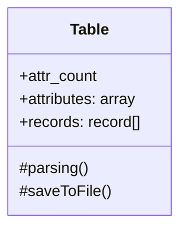

# 나만의 체크포인트

  

## 설계하기

  

- [x] 설계 - 기본 인터페이스 ✅ 2024-08-05

- [x] 설계 - create ✅ 2024-08-05

- [x] 설계 - insert ✅ 2024-08-05

- [x] 설계 - delete ✅ 2024-08-05

- [x] 설계 - update ✅ 2024-08-05

- [x] 설계 - select ✅ 2024-08-05

- [x] 설계 - drop ✅ 2024-08-05

  

## 구현하기

  

- [x] 기본 인터페이스 ✅ 2024-08-06

- [x] create ✅ 2024-08-06

- [x] insert ✅ 2024-08-06

- [x] delete ✅ 2024-08-06

- [x] update ✅ 2024-08-06

- [x] select ✅ 2024-08-06

- [x] drop ✅ 2024-08-06

  

# 문제 해결 과정

  

## 설계하기

  

해당 학습목표는 데이터베이스 관리 시스템 학습을 위한 SQL 문법과 유사하게 파일 기반으로 테이블을 관리하고 Record를 생성, 업데이트, 삭제하는 프로그램을 만드는 것이 목표이다.

이러한 데이터베이스 관리하기 위해서는 요청을 보내야 하는데, 이러한 요청을 http 요청과 응답 형식으로 구현함으로써 http 통신에 대한 이해도 또한 함양시키기 위한 문제라고 생각한다.

  

맨 처음 설계에서 구현할 때 고민했던 부분은 읽어들이는 CSV 파일에 대해 어떻게 관리할 것이냐를 고민했다.

  

```

singer,year,song

-----------

honux,2016,Gameover

jk,2020,I like steak

crong,2023,Milk song

ivy,2021,Butter

  

```

  

문제의 예시에서는 CSV 파일을 주었는데, 이러한 파일에 대해서 레코드를 추가하거나 삭제 등 다양한 명령어들에 대해서 처리할 수 있어야 한다. 이를 위해서는 CSV 파일을 읽어들인 뒤에 적절한 데이터 타입으로 변환해준 다음에 관리하는 것이 보다 합리적이라고 생각했다.

  

나의 경우는 Table클래스에 각 Column(Attribute)과 레코드를 배열로 따로 저장해두는 것을 생각했다.

여기서 레코드를 객체로 따로 만들지 않은 이유는 나중에 계속해서 정보를 갱신하는 과정에서 insert할 때 순서를 가지는 프로퍼티를 하나 더 둠으로써 각 attribute가 어떠한 인덱스를 가지는지 나타내려고 한다.

  



  

### 기본 인터페이스

  

기본 인터페이스는 저번 mit 미션에서 사용했던 commander 패키지를 사용하여 처리하려고 한다. 내 의존성을 설치하고 실행시키면 이에 해당하는 명령어를 입력할 수 있는 인터페이스를 주고, 각 명령어를 따로 파싱하여 처리한 다음에 해당 쿼리의 명령에 따라 다른 함수 인터페이스를 제공하려고 한다.

  

### Create

  

Create 요청의 경우 테이블을 생성하는 요청으로 내가 설정하려는 테이블의 Attribute(Column)을 설정한다.

  

```

CREATE table_name BTTP

Column: column1=datatype

Column: column2=datatype

Column: column3=datatype

```

  

create 요청의 경우 새롭게 csv 파일을 만들어야 하며,

  

1. 형식 검사

2. datatype 추출해서 객체 만들기

3. 객체 파일로 저장

의 과정을 거쳐 attribute들만 있는 CSV 파일을 저장한다.

여기서 제약사항으로 9개까지만 지원하도록 하는 조건과

여기서 추가적으로 datatype을 검사해서 Numeric, String만을 넣을 수 있게 해야 하고, attribute에 대해서는 나중에 해당하는 데이터타입을 검사해서 데이터를 생성해야 하므로 각 attribute 또한 객체를 만들어 key:value 형태로 데이터타입을 넣어 할 수 있게 하려고 한다.

  

### Insert

  

Insert 요청은 테이블에 레코드를 추가하는 메서드이다.

  

```

INSERT table_name BTTP

Column: column1

Column: column2

Value: value1

Value: value2

```

  

레코드를 추가하면서 column개수를 검사하여 기존의 column 개수와 같지 않으면 예외처리를 한다.

개수가 같다면 column의 순서대로 value를 넣어주면 될 것 같다.

  

### Delete

  

delete는 테이블의 레코드를 삭제하는 것으로, condition에 맞는 것들을 모두 삭제한다. 이 때 condition에 하나만 포함하면 되므로 attribute와 조건, 논리연산자를 추출해내어 검사한다.

  

### Update

  

레코드를 변경하는 메서드로 조건에 맞는 레코드의 특정 컬럼 값을 변경하면 되므로 이 또한 attribute와 조건, 논리연산자를 추출해내어 처리하면 된다.

  

### Select

  

테이블에 레코드를 검색하는 형식으로, 조건에 맞는 컬럼만 출력하면 된다.

  

### Drop

  

테이블 이름과 동일한 CSV파일을 통채로 삭제하면 된다.

  

# 구현하기

  

# 인터페이스

  

```js

#!/usr/bin/env node

const { program } = require("commander");

const { commandInterface } = require("./interface");

  

program.version("0.0.1", "-v, --version").name("commander");

  

program.command("run").action(() => {

commandInterface();

});

  

program.parse(process.argv);

```

  

인터페이스의 경우 시작 점에서 mhcsv run을 터미널에 입력하면 명령어 창이 나온다. 이후에 명령어들을 계속해서 실행할 수 있다.

주어지는 입력은 commandInterface를 통해 실행되고 처리한다.

  

```js

const readline = require("readline");

const { parsingCommand } = require("./parsing");

const { handleCommand } = require("./handlecommand");

  

const rl = readline.createInterface({

input: process.stdin,

output: process.stdout,

});

const commandInterface = (command) => {

console.log("실행할 요청 파일을 입력하세요\n");

rl.on("line", (line) => {

if (!line || line === "q") rl.close();

try {

const { command, file } = parsingCommand(line);

console.log(">>>>>>>>>>>>\n");

handleCommand(file);

} catch (error) {

console.log("<<<<<<<<<<<");

console.log(error.message);

}

});

};

  

module.exports = { commandInterface };

```

  

나같은 경우는 명령어 창을 계속 켜놓고 해당 명령어를 그때마다 파싱하여 알맞은 커맨드에 대한 실행을 handleCommand가 담당한다.

  

```js

const { readFileSync } = require("fs");

const { create } = require("./create");

const { insert } = require("./insert");

const { deleteRecord } = require("./delete");

const { update } = require("./update");

const { drop } = require("./drop");

  

function handleCommand(fileName) {

const command = readFileSync(`./${fileName}`)

.toString()

.split("\n")[0]

.split(" ")[0];

switch (command) {

case "CREATE":

create(fileName);

break;

case "INSERT":

insert(fileName);

break;

case "DELETE":

deleteRecord(fileName);

break;

case "UPDATE":

update(fileName);

break;

case "SELECT":

break;

case "DROP":

drop(fileName);

break;

default:

throw new Error("400 Bad Request");

}

}

  

module.exports = { handleCommand };

```

  

이처럼 switch/case문을 통해 각 명령어에 대해서 함수를 실행하도록 구현했다.

  

## 테이블 클래스

  

```js

const { readFileSync, existsSync, writeFileSync } = require("fs");

const { getTableName } = require("./create");

  

class Table {

constructor(tableName, types, attributes, records) {

this.tableName = tableName;

this.types = types;

this.attributes = attributes;

this.attributesLen = this.attributes.length;

this.records = records;

this.currIdx = this.records.length + 1;

this.index = this.#getIndex();

}

static getFile(fileName) {

console.log(readFileSync(`./${fileName}`).toString());

const fileData = readFileSync(`./${fileName}`).toString().split("\n");

const tableName = getTableName(fileData[0]);

if (!existsSync(`./${tableName}.csv`) || !existsSync(`./${tableName}.json`))

throw new Error("404 CSV file Not Found");

const data = readFileSync(`./${tableName}.csv`).toString().split("\n");

const metaData = JSON.parse(readFileSync(`./${tableName}.json`).toString());

let attributes = [];

if (data.length > 1) {

attributes = data.slice(1, data.length - 1).map((attr) => {

let attrArr = attr.split(",");

attrArr = attrArr.map((attr) => {

if (!attr.includes('"')) return parseInt(attr);

return attr;

});

return attrArr;

});

}

console.log("<<<<<<<<<<");

return new Table(tableName, metaData.types, data[0].split(","), attributes);

}

  

#getIndex() {

let index = {};

this.attributes.forEach((attr, idx) => {

index[attr] = idx;

});

return index;

}

  

saveToFile() {

let fileData = this.attributes.join(",") + "\n";

this.records.forEach((record) => {

fileData += record.join(",") + "\n";

});

writeFileSync(`./${this.tableName}.csv`, fileData);

console.log("200 OK");

console.log("Content-Type: Text/JSON");

console.log(`Content-Length: ${fileData.length}`);

}

  

insert(values) {

if (values.length !== this.attributesLen - 1)

throw new Error("400 values have different length");

const types = Object.values(this.types);

const newRecord = { id: this.currIdx };

values.forEach((val, index) => {

if (types[index + 1] !== typeof val) {

throw new Error("400 type not matched");

}

newRecord[this.attributes[index + 1]] = val;

});

this.records.push([this.currIdx, ...values]);

this.currIdx++;

console.log(newRecord);

this.saveToFile();

}

delete(targetIndex, targetVal) {

this.records = this.records.filter((record) => {

record[targetIndex] !== targetVal;

});

this.saveToFile();

}

update(col, val, con_col, con_val) {

if (!this.index.hasOwnProperty(col))

throw new Error("404 column not Found");

if (!this.index.hasOwnProperty(con_col))

throw new Error("404 condition column not Found");

  

const targetCol = this.index[con_col];

const updateCol = this.index[col];

  

this.records.forEach((record, idx) => {

if (record[targetCol] == con_val) {

record[updateCol] = val;

}

});

this.saveToFile();

}

}

  

module.exports = { Table };

```

  

기존에 설계하던 프로퍼티들과 메서드간에는 차이가 다소 있다.

  

\계속해서 쓰이는 파일을 읽어 처리하는 기능을 정적 메서드로 구현하여 새로운 Table 객체를 반환하게 함으로써 해당 테이블의 메서드를 사용할 수 있게 해두었다. 각 명령어의 메서드는 그에 따른 함수가 있지만, 최종적으로는 대부분 이 메서드들을 통해서 정보가 갱신된다.

  

프로퍼티같은 경우는 어트리뷰트와 그 길이, 레코드와 현재의 끝 id값, index는 각 어트리뷰트마다 가지는 인덱스를 객체 형태로 기록해놓았다.

  

타입같은 경우는 따로 만든 json 파일을 가지고 해당 메타데이터를 타입 프로퍼티에 넣어주는 방식으로 구현했다.

  

## Create

  

```js

const { writeFileSync, existsSync, readFileSync, mkdir } = require("fs");

  

function create(fileName) {

let attributes = [`id`];

let metaData = { fileName: fileName, types: { id: "number" } };

let tableName;

const data = readFileSync(`./${fileName}`).toString();

  

data.split("\n").forEach((attr, idx) => {

console.log(attr);

if (idx === 0) tableName = getTableName(attr);

else {

if (!attr) return;

const { attribute, type } = getColumn(attr);

attributes.push(`${attribute}`);

if (type === "Numeric") metaData.types[attribute] = "number";

else metaData.types[attribute] = "string";

}

});

  

if (existsSync(`./${tableName}.csv`))

throw new Error("409 File Already Exists");

writeFileSync(`./${tableName}.csv`, attributes.join(",") + "\n");

writeFileSync(`./${tableName}.json`, JSON.stringify(metaData));

console.log("\n<<<<<<<<<<<");

console.log("201 Created");

}

  

const getTableName = (line) => {

const [_, tableName, bttp] = line.split(" ");

if (bttp !== "BTTP") throw new Error("400 Invalid Bttp request");

return tableName;

};

  

const getColumn = (line) => {

const regex = /^Column:\s(\w+)\=(String|Numeric)/;

if (!regex.test(line)) throw new Error("400 Invalid Column Syntax");

const attribute = line.match(regex)[1];

const type = line.match(regex)[2];

return { attribute, type };

};

  

module.exports = { create, getTableName };

```

  

create는 처음 bttp 파일에 대해서 처리를 해줘야 하므로 다소 긴 경향이 있다.

주요 로직은

  

1. 파일을 읽어 줄마다 처리 + 유효성 검증

2. numeric타입이 자바스크립트에서 typeof를 사용할 때 유용하지 않으므로 number로 치환

3. 새로운 JSON 파일에 타입 정보를 보관 및 저장

의 로직을 가진다.

  

### 작동결과

  


야호~


  

## insert

  

```js

const { readFileSync, existsSync } = require("fs");

const { getTableName } = require("./create");

const { Table } = require("./table");

  

function insert(fileName) {

const insertData = readFileSync(`./${fileName}`)

.toString()

.split("\n")

.slice(1);

const table = Table.getFile(fileName);

const { attrs, values } = getAttrAndVal(insertData);

table.insert(values);

}

  

const getAttrAndVal = (insertData) => {

const attrs = [];

const values = [];

insertData.forEach((data) => {

let [colOrVal, val] = data.split(" ");

if (colOrVal === "Column:") {

if (!val.includes('"')) val = parseInt(val);

attrs.push(val);

} else if (colOrVal === "Value:") {

if (!val.includes('"')) val = parseInt(val);

values.push(val);

} else {

throw new Error("400 Bad Request");

}

});

if (attrs.length !== values.length)

throw new Error("400 Column not matched to Value");

return { attrs, values };

};

  

module.exports = { insert };

```

  

insert는 생각보다 많이 까다로웠다. 처음에는 들어오는 모든 값들이 무작위로 주어져서 해당 인덱스값을 계속 대조하여 알맞은 형태로 레코드를 만들어 넣어야 하는 것이 아닐까? 생각했는데 찾아봤더니 sql 쿼리문에서는 따로 순서를 지정해야 한다.

  

```sql

INSERT INTO Temp_Table(field1, field2, field4, field3, field5, field6, field7, field8, field9, field10)

VALUES('data4','data4-2','data4-4','data4-3','data4-5','data4-6','data4-7','data4-8','data4-9','data4-10');

```

  

따라서 나는 그냥 어트리뷰트 순서대로 레코드가 들어올 것이고, 나는 그냥 타입 체크만 하면 되겠다 생각하고 구현했다.

  

### 실행결과

  


  


  

## update

  

```js

const { readFileSync } = require("fs");

const { Table } = require("./table");

  

function update(fileName) {

const table = Table.getFile(fileName);

const updateData = readFileSync(`./${fileName}`)

.toString()

.split("\n")

.slice(1);

const [col, colData] = updateData[0].split(" ");

const [val, valData] = updateData[1].split(" ");

let [con, conData] = updateData[2].split(" ");

if (col !== "Column:" || val !== "Value:" || con !== "Condition:")

throw new Error("400 Bad Request(command)");

const [conData_col, conData_val] = conData.split("=");

  

table.update(colData, valData, conData_col, conData_val);

}

  

module.exports = { update };

```

  

update는 조건에 해당하는 레코드를 찾아서 설정한 column값의 인덱스에 지정한 value값을 넣어주도록 했다.

조건이 까다롭지는 않지만 각종 파라미터들의 파싱이 많다보니 복잡해진 경향이 있다.

  

### 실행결과

  


  

## Delete

  

```js

const { readFileSync } = require("fs");

const { Table } = require("./table");

  

function deleteRecord(filename) {

const file = Table.getFile(filename);

if (!file.records.length) throw new Error("404 record not exist");

const [text, condition] = readFileSync(`./${filename}`)

.toString()

.split("\n")[1]

.split(" ");

if (text !== "Condition:") throw new Error("400 Bad Request");

const [col, con] = condition.split("=");

if (!col || !con) throw new Error("400 Bad Request(Condition)");

console.log(col, con);

const targetIndex = file.index[col];

file.delete(targetIndex, con);

}

  

module.exports = { deleteRecord };

...

//클래스 메서드

delete(targetIndex, targetVal) {

this.records = this.records.filter((record) => {

record[targetIndex] !== targetVal;

});

this.saveToFile();

}

  

```

  

Delete의 경우에는 조건을 검색하는 방식이 update와 비슷하게 작동하기 때문에 일부분을 재활용했다.

특이한 점(?)으로는 기존의 레코드 배열들을 고차함수 filter를 통해 걸러주어 코드가 보다 깨끗해졌다.

  

### 실행 결과

  


  

## SELECT

  

해커톤땜에 준비하느라 시간부족이슈로 내일 시간이 된다면 구현할듯 싶다..

가도 빌드하면서 기다리면서 조금씩 했다.

자고싶다..

  

```js

const { readFileSync } = require("fs");

const { Table } = require("./table");

  

function select(fileName) {

const table = Table.getFile(fileName);

const [con, condition] = readFileSync(`./${fileName}`)

.toString()

.split("\n")[1]

.split(" ");

if (con !== "Condition:") throw new Error("400 Bad Request(condition)");

console.log(condition);

const regex = /(\w+)([=><])([\w"]+)/;

const matched = condition.match(regex);

const col = matched[1];

const logic = matched[2];

const val = matched[3];

table.select_equal(col, val);

}

  

module.exports = { select };

  

...

//테이블 클래스 메서드

select_equal(col, val) {

const idx = this.index[col];

const result = [];

this.records.forEach((record) => {

if (record[idx] === val) {

result.push(record);

}

});

this.recordToObject(result);

}

recordToObject(arr) {

const result = [];

arr.forEach((record) => {

let converted = {};

record.forEach((attr, idx) => {

converted[this.attributes[idx]] = attr;

});

result.push(converted);

});

console.log(result);

}

```

  

Select의 경우 현재는 equal = 만 따로 처리를 하는 로직을 만들어놨다.

생각해보니 일치와 같은 경우는 어차피 index값을 통해 각 어트리뷰트에 대한 값을 잘 뽑아낼 수 있으므로 맨 처음에 정규표현식을 통해 그룹캡처를 해서 필요한 조건(어트리뷰트, 값, 논리연산자)를 뽑아내고 각각 논리연산자에 따라 로직을 switch/case문을 통해 처리할 예정이다.

현재 등호만 해놨는데, 등호의 경우에는 레코드를 전부 돌면서 해당 값과 같은 레코드들만 찾아내서 뽑아내면 된다.

  

### 실행결과

  


  

## DROP

  

```js

const { existsSync, readFileSync, unlinkSync } = require("fs");

const { Table } = require("./table");

  

function drop(fileName) {

if (!existsSync(`./${fileName}`)) throw new Error("404 file not found");

const table = Table.getFile(fileName);

const length = readFileSync(`./${fileName}`).toString().length;

if (!existsSync(`./${fileName}`)) throw new Error(`404 file not found(csv)`);

unlinkSync(`./${table.tableName}.csv`);

unlinkSync(`./${table.tableName}.json`);

console.log("<<<<<<<<<<<");

console.log("200 OK");

console.log(`Row-Count: ${length}`);

}

  

module.exports = { drop };

```

  

DROP은 unlinksync를 사용해주기만 하면 됐으므로 일단은 처음에 테이블 객체를 받아오는 정적 메서드를 통해서 테이블 객체를 받아온 뒤, 해당 파일 이름의 프로퍼티를 가져와 이를 지워주는 방식으로 사용했다.

  

### 실행결과

  


  


  

# 학습

  

### SQL

  

https://medium.com/@queenskisivuli/how-sql-writes-data-insert-create-and-delete-3b5536d9370b

https://rachel0115.tistory.com/entry/SQL-%EA%B8%B0%EB%B3%B8-%EB%AC%B8%EB%B2%95-%EC%A0%95%EB%A6%AC-SELECT-%EC%A0%88

https://inpa.tistory.com/entry/MYSQL-%F0%9F%93%9A-%ED%8A%B8%EB%9E%9C%EC%9E%AD%EC%85%98Transaction-%EC%9D%B4%EB%9E%80-%F0%9F%92%AF-%EC%A0%95%EB%A6%AC

  

### 데이터베이스

  

https://velog.io/@hsshin0602/CS-%EC%A7%80%EC%8B%9D-%EB%8D%B0%EC%9D%B4%ED%84%B0%EB%B2%A0%EC%9D%B4%EC%8A%A4-%EC%8B%9C%EC%8A%A4%ED%85%9C-VS-%ED%8C%8C%EC%9D%BC-%EC%B2%98%EB%A6%AC-%EC%8B%9C%EC%8A%A4%ED%85%9C

https://hongong.hanbit.co.kr/%EB%8D%B0%EC%9D%B4%ED%84%B0%EB%B2%A0%EC%9D%B4%EC%8A%A4-%EC%9D%B4%ED%95%B4%ED%95%98%EA%B8%B0-databasedb-dbms-sql%EC%9D%98-%EA%B0%9C%EB%85%90/

  

### 트랜잭션

  

https://mommoo.tistory.com/62

  

# 개선하기

  

- [x] 함수분리
이번 리팩토링에서는 여러 메서드의 처리를 담당하는 switch문 안의 함수들을 대부분 길이를 최대한 줄이는 것이 목표였다. 피어와 이러한 부분을 하나씩 보면서 좀더 집중하여 코드를 간략하게 줄이는 방법에 대해서 많이 고안했다.
```js
function create(fileName) {
  const data = readFileSync(`./${fileName}`).toString();
  const { attributes, metaData, tableName } = parsingCreate(data, fileName);

  if (existsSync(`./${tableName}.csv`))
    throw new Error("409 File Already Exists");
  writeFileSync(`./${tableName}.csv`, attributes.join(",") + "\n");
  writeFileSync(`./${tableName}.json`, JSON.stringify(metaData));
  console.log("\n<<<<<<<<<<<");
  console.log(STATUS_CODE[201]);
}
...
const parsingCreate = (data) => {
  let attributes = [`id`];
  let metaData = { fileName: "", types: { id: "number" } };
  let tableName;
  data.split("\n").forEach((attr, idx) => {
    console.log(attr);
    if (idx === 0) {
      tableName = Table.getTableName(attr);
      metaData.fileName = tableName;
    } else {
      if (!attr) return;
      const { attribute, type } = getColumn(attr);
      attributes.push(attribute);
      if (type === "Numeric") metaData.types[attribute] = "number";
      else metaData.types[attribute] = "string";
    }
  });
  return { tableName, attributes, metaData };
};
```
대표적인 create 메서드의 경우, 이전까지는 parsingCreate이라는 함수를 따로 두지 않고 이러한 메타데이터, 어트리뷰트, 테이블 이름 등을 추출해 내는데 해당 함수 안에서 모두 처리하다보니 함수의 가독성 자체가 매우 떨어졌다. 그러다보니 이러한 부분을 개선해야 할 필요성을 자연스럽게 구현하는 과정에서 느끼게 되었고, 이를 개선하기에서 고쳐야겠다고 생각했다.
사실 조금 더 좋은 방식은 어트리뷰트와 메타데이터, 테이블 이름을 다 함수로 분리한다면 보다 해당 함수의 길이가 짧아질 수는 있겠지만, 사실한 하나의 파일에 대해 여러번 반복문을 돌며 처리하는 꼴이 되기 때문에 성능면에서 손해라고 생각하여 하나의 함수에 처리하는 것으로 생각했다.

- [x] 상태 코드 상수화
```js
const STATUS_CODE = {
  200: "200 OK",
  201: "201 CREATED",
  400: "400 BAD REQUEST",
  404: "404 FILE NOT FOUND",
  500: "500 INVALID BTTP REQUEST",
};

module.exports = { STATUS_CODE };

```
상태 코드 상수화의 경우 다양한 상태코드가 있지만 주로 응답 코드에 맞는 메세지가 있는데, 이를 매치하기 위해 여러 코드를 구별하서 쓰다 보니 항상 나오는 에러코드들은 정해져 있었다.
이에 이러한 에러에 대해 매번 에러를 throw하는 과정에서 굳이 메세지를 하드코딩하기보단, 상수화시켜서 이를 import해와서 사용하는 방식으로 사용하면 나중에도 예외처리를 할 때 편해질 것 같아서 개선을 진행했다.

- [x] json 구조 바꾸기
```json
{
  "fileName": "billboard",
  "types": {
    "id": "number",
    "singer": "string",
    "year": "number",
    "song": "string"
  }
}

```

나는 기존 파일에 타입을 다른 구분자를 붙여 구분하는 것은 원래의 형식에 벗어나기도 하고, 원래도 메타데이터를 두고 관리한다는 이야기를 들어 타입과 같은 메타데이터를 따로 두려고 했었다. 그러나 이러한 타입만을 따로 두기에는 json파일에 대해 오히려 낭비같다는 생각이 들어, 내가 나중에 처리해서 쓸만한 데이터들을 따로 보관하기로 했었다.
따라서 나는 fileName과 type을 두었으며, fileName의 경우 후에 json 파일을 읽어들어와 filename을 쉽게 뽑아내어 파일에 대한 처리가 보다 쉬워질 수 있다고 생각하여 json구조를 기존 파일명을 보관하는 것보다는 테이블의 이름을 기억하여 활용할 수 있도록 하였다.
''