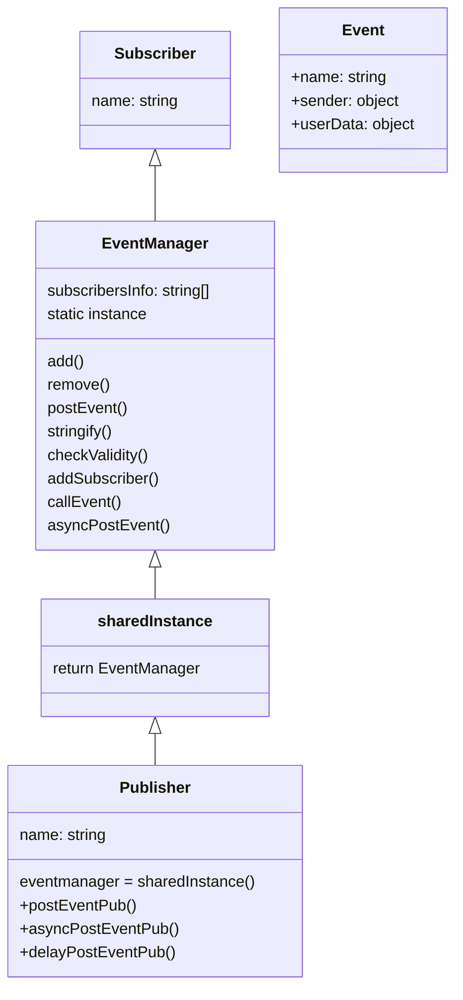

# 👥 28-B 팀, J238 J188

  

# 체크포인트


### 학습하기

  

- [x] Publisher-Subscriber 패턴과 싱글톤 패턴

- [ ] 동기와 비동기 작업 처리 방식 비교

- [ ] 비동기 함수 호출 과정

- [ ] 동기화 과정

- [ ] 멀티 스레드 방식과 스레드에서 비동기 병렬 처리 방식

- [ ] 특정 스레드에서 이벤트 루프를 만들어 각 이벤트를 전달하는 방식

- [ ] 비동기 작업을 동기화해서 기다리는 방식

- [ ] 비동기 작업을 그룹으로 묶어서 동기화하는 방식

- [ ] 노드 환경에서 이벤트 루프와 이벤트 처리(Event Emmiter) 방식

- [ ] 여러 Thread를 미리 만들어 Pool 형태로 관리하는 방식

  

### 설계 및 구현하기

  

- [x] EvenyManager 클래스 설계

- [x] SharedInstance 함수

- [x] Subscriber 데이터 구조와 표

- [x] Subscriber 클래스

- [x] Sender 클래스

- [x] remove 함수

- [x] postEvent 함수

- [x] stringify 함수

- [x] 비동기 개선 ✅ 2024-07-26


  # 구조 설계
  


  

---  
# Pub-Sub 패턴


발행-구독 패턴은 Publisher가 Subscriber의 위치나 존재를 알 필요 없이 브로커에게 메시지를 던져놓기만 하면 되며 반대로 Subscriber 역시 브로커에 할당된 작업만 모니터링하다 작업하면 되므로 옵저버 패턴에 비해 결합도가 더 낮다.  

또한 발행-구독 패턴은 브로커라는 중간 매개체가 있기 때문에  브로커에 직접 접근하여 처리할 수도 있다.
# 구현하기
## EventManager 클래스


EventManager 클래스는 싱글톤 패턴을 이용하여 공유하는 EventManager를 통해 Publisher가 EventManager에 갈 수 있는 경로를 마련한다고 생각했다.
SharedInstance라는 함수를 만들어 new 키워드를 통한 인스턴스를 생성했지만, 생성된 인스턴스가 있을 경우 기존의 인스턴스를 반환하는 방식으로 만들어 Publisher의 eventManager property에도 넣어주어 접근할 수 있게 하였다. 
```js
class Publisher {
  constructor(name) {
    this.name = name;
    this.eventManager = sharedInstance();
  }
...
}
```

```js
class EventManager {
  static instance;

  constructor() {
    if (EventManager.instance) {
      return EventManager.instance;
    }
    this.subscriberInfos = []; // 구독자 목록 저장 배열
    EventManager.instance = this;
    this.eventEmitter = new EventEmitter();
  }
  ...
```
이렇게 Publisher가 직접적으로 공유하는 인스턴스를 통해 Publisher 자체의 property에서 EventManager로 갈 수 있게 해준 다음에 이벤트를 추가하는 메소드를 Publisher 안에서 만든 다음 EventMager로 전달해주어 생성되게끔 해주면서 다수의 이벤트가 있더라도 하나의 Publisher를 통해 만들 수 있는 방법을 고안했다.

## add 함수
```js
 // subscriber 등록 (eventName, sender)
  add(subscriber, eventName, sender, handler) {
    const subscribeData = {
      subscriber: subscriber,
      eventName: eventName,
      sender: sender,
      handler: handler,
    };
    if (
      this.subscriberInfos.some((subInfo) =>
        this.#checkValidity(subInfo, subscribeData)
      )
    ) {
      return;
    }
    this.subscriberInfos.push(subscribeData);
    return;
  }
```

전체적으로 EventManager에서 존재하는 메소드들은 복잡한 로직으로 되어 있지 않다. 유효성(같은 이름의 이벤트 걸러주기)만 검사해준 뒤에 `subscriberInfos`라는 배열에 들어갈 수 있게끔 하고, 나중에 해당 배열에 대해서만 관리하면서 이벤트에 대해 처리할 수 있도록 해주었다.
## PostEvent 함수

```js
postEvent(eventName, sender, userInfo) {
    const newEvent = new Event(eventName, sender, userInfo);
    let result;
    this.subscriberInfos.forEach((subscriberInfo) => {
      if (
        !subscriberInfo.eventName ||
        (subscriberInfo.eventName === eventName &&
          subscriberInfo.sender.name === sender.name) ||
        !subscriberInfo.sender
      ) {
        process.stdout.write(`${subscriberInfo.subscriber.name}: `);
        console.log(
          `${subscriberInfo.subscriber.name}: ${eventName} event from ${
            sender.name
          } userData = ${JSON.stringify(userInfo)} `
        );
        result = subscriberInfo.handler(newEvent);
      }
    });
    return result;
  }
```

postEvent 함수는 이미 추가시킨 이벤트에 대해서 실행시켜주는 메소드이다. 해당 메소드에서는 eventName, sender 인스턴스, userInfo 객체를 받는다. 그러면 받은 인수를 토대로 새로운 Event라는 인스턴스를 만들어주고, 이에 대해 핸들러 함수가 클로저로 실행될 수 있게끔 해주었다.

이 때, 맨 처음에 eventName이 `""` 빈 문자열로 되어 있으면 모든 이벤트를 실행시켜주어야 하고, Publisher의 이름이 undefined라면 모든 이벤트를 실행시켜 주어야 했다.
처음에는 이러한 배열을 만들기 전에 들어오는 값에 대해 검사를 하고, 빈 문자열의 경우와 undefined된 Publisher의 이름에 대해서 처리를 해주고 상황에 맞게 모든 이벤트들을 만들어낼까 생각을 했었는데, 이렇게 논리연산자와 고차함수의 이용을 통해서 이벤트를 실행시켜주는 편이 보다 메모리 절약이 되지 않았나 생각한다.

## remove 함수
```js
  remove(subscriber) {
    this.subscriberInfos = this.subscriberInfos.filter(
      (subscriberInfo) => subscriberInfo.subscriber !== subscriber
    );
  }
```
remove함수는 filter 고차함수를 이용해 간단하게 비교하면서 걸러줄 수 있었다
## stringify 함수
처음에는 stringify가 조건을 알려주는 함수라길래 무슨 말인가 했다.
어차피 이벤트를 실행하는 조건의 경우는 위에서 이벤트 실행 함수를 통해서 걸러주었기 때문에 어떤 subscriber에 어떤 event들이 들어가 있는지를 알려주는 함수정도라고 해석해싿.
```js
  stringify() {
    this.subscriberInfos.forEach((subscriberInfo) => {
      console.log(
        `${subscriberInfo.subscriber.name} : event name = "${subscriberInfo.eventName}", sender = ${subscriberInfo.sender.name}`
      );
    });
  }
```

## addSubscriber , callEvent 함수
```js
addSubscriber(subscriber, eventName, sender, handler) {
    const subscribeData = {
      subscriber: subscriber,
      eventName: eventName,
      sender: sender,
      handler: handler,
    };
    if (
      this.subscriberInfos.some((subInfo) =>
        this.#checkValidity(subInfo, subscribeData)
      )
    ) {
      return;
    }
    this.subscriberInfos.push(subscribeData);
    this.eventEmitter.on(eventName, (data) =>
      this.postEvent(eventName, sender, data)
    );
    return;
  }

  callEvent(eventName, data) {
    const result = this.eventEmitter.emit(eventName, data);
    if (!result) return { data: null, completed: false };
    return { data: result, completed: true };
  }
```
addSubscriber 함수는 조금 더 사용성이 좋도록 만들어진 함수이다. 기존 add 함수의 발전형이라고 생각하면 될 것 같다. 
기존의 add와 마지막까지 거의 같은 구조를 지녔지만, 큰 차이점은 `eventEmmiter`의 유무이다. eventEmmiter를 사용하여 해당 이벤트에 대해서 실행할 수 있는 함수를 보다 간결하게 `callEvent(이벤트 이름, 데이터)`의 형태로 호출할 수 있도록 해주어 다른 정보들을 굳이 기재할 불편함을 감소시켰다.

## AsyncPostEvent 함수

```js
asyncPostEvent(eventName, sender, userInfo) {
    return new Promise((resolve, reject) => {
      const result = this.postEvent(eventName, sender, userInfo);
      console.log(result);
      if (!result) reject({ completed: false });
      resolve(result);
    });
  }
```
해당 함수는 postEvent와 같은 역할을 하지만 비동기 방식으로 구현된 함수이다.
차이점은 Promise를 사용했기 때문에 해당 메소드를 사용하기 위해서는 `.then`이나 async/await 키워드를 통해 동기 방식으로 바꿔준 후에 사용해야 한다.

## delayPostEvent 함수
```js
delayPostEvent(eventName, sender, userInfo, timeout) {
    return new Promise((resolve, reject) => {
      setTimeout(() => {
        resolve(this.postEvent(eventName, sender, userInfo));
      }, timeout);
    });
  }
}
```
delayPostEvent는 비동기 방식으로 처리하는 postEvent 함수 버전에 시간지연까지 추가한 버전이다. setTimeout을 사용해 비동기적으로 함수를 호출하고, 해당하는 시간이 지나면 값을 resolve 시켜주었다.

### Subscriber 클래스
```js
class Subscriber {
  constructor(name) {
    this.name = name;
  }
}

module.exports = { Subscriber };

```
  휑~
굳이 인스턴스화시키지 말고 객체 형태로 만들어도 좋았을듯...?

## Publisher 클래스
```js
const { EventManager, sharedInstance } = require("./eventManager");

class Publisher {
  constructor(name) {
    this.name = name;
    this.eventManager = sharedInstance();
  }

  postEventPub(eventName, userInfo) {
    return this.eventManager.postEvent(eventName, this, userInfo);
  }

  asyncPostEventPub(eventName, userInfo) {
    return this.eventManager.asyncPostEvent(eventName, this, userInfo);
  }

  delayPostEventPub(eventName, userInfo) {
    return this.eventManager.delayPostEvent(eventName, this, userInfo);
  }
}

module.exports = { Publisher };

```

얜 그나마 있는 편이다.
postEvent함수들에 대해서 먼저 Publisher의 메서드를 통해 실행하고 eventManager에 진입하여 해당하는 이벤트를 실행하는 방식으로 설계하였다.

  
# 테스트 코드 작성
```js
jest.setTimeout(30000);
const { EventManager } = require("./eventManager");
const { Publisher } = require("./publisher");
const { Subscriber } = require("./subscriber");

const eventManager = new EventManager();
const subscriber0 = new Subscriber("testSub0");
const publisher0 = new Publisher("testPub0");

describe("테스트", () => {
  test("eventManager 동일성 테스트", () => {
    const eventManagerA = new EventManager();
    const eventManagerB = new EventManager();
    expect(eventManagerA).toEqual(eventManagerB);
  });

  test("Subscriber 등록 테스트", () => {
    eventManager.add(subscriber0, "test", publisher0, (newEvent) => {
      return "success";
    });
    expect(eventManager.subscriberInfos.length).toBe(1);
  });

  test("Subscriber 중복 등록 테스트", () => {
    eventManager.add(subscriber0, "test", publisher0, () => {
      return "success";
    });
    expect(eventManager.subscriberInfos.length).toBe(1);
  });

  test("postEvent 동작 테스트", () => {
    expect(publisher0.postEventPub("test", { content: "content" })).toBe(
      "success"
    );
  });

  test("remove 동작 테스트", () => {
    eventManager.remove(subscriber0);
    expect(eventManager.subscriberInfos.length).toBe(0);
  });

  test("EventEmmiter 테스트", () => {
    eventEmitter.emit("addSub", "testSub0", "event", "testPub0", () => {
      console.log("test");
    });
  });

  test("addSubscriber 테스트", () => {
    eventManager.addSubscriber(subscriber0, "emmiterTest", publisher0, () => {
      console.log("이벤트 등록 후 실행");
    });
    expect(eventManager.callEvent("emmiterTest", { data: "wwww" }).data).toBe(
      true
    );
  });

  test("asyncPostEvent 테스트", async () => {
    eventManager.add(subscriber0, "asyncPostEvent test", publisher0, () => {
      return "asyncPostEvent Test";
    });
    const result = await eventManager.asyncPostEvent(
      "asyncPostEvent test",
      publisher0,
      {
        data: "async test",
      }
    );
    expect(result).toBe("asyncPostEvent Test");
  });

  test("delayPostEvent 테스트", async () => {
    eventManager.add(subscriber0, "delayPostEvent test", publisher0, () => {
      return "delayPostEvent Test";
    });
    const result = await eventManager.delayPostEvent(
      "delayPostEvent test",
      publisher0,
      {
        data: "delay test",
      },
      3000
    );
    console.log(result);
    expect(result).toBe("delayPostEvent Test");
  });

  test("비동기 동작 시나리오 테스트1", () => {
    const subscriberA = new Subscriber("subscriberA");
    const albumModel = new Publisher("albumModel");
    eventManager.addSubscriber(
      subscriberA,
      "ModelDataChanged",
      albumModel,
      (obj) => {
        return obj.eventName;
      }
    );
    const result = eventManager.callEvent("ModelDataChanged", {
      data: "ModelDataChanged Event",
    });
    expect(result.data).toBe(true);
  });

  const testSub = new Subscriber("testSub");

  test("비동기 동작 시나리오 테스트2(동기)", () => {
    console.log("222");
    const albumTableView = new Publisher("albumTableView");
    eventManager.add(testSub, "syncEvent", albumTableView, (obj) => {
      return obj.eventName;
    });

    expect(
      eventManager.postEvent("syncEvent", albumTableView, {
        user: "user",
      })
    ).toBe("syncEvent");
  });

  const albumTableViewController = new Publisher("albumTableViewController");

  test("비동기 동작 시나리오 테스트 3(비동기)", async () => {
    eventManager.add(testSub, "asyncEvent", albumTableViewController, (obj) => {
      return obj.eventName;
    });
    expect(
      await eventManager.asyncPostEvent(
        "asyncEvent",
        albumTableViewController,
        {
          user: "user",
        }
      )
    ).toBe("asyncEvent");
  });

  test("비동기 동작 시나리오 테스트 4(지연 비동기)", async () => {
    console.log("444");
    const dummySub = new Subscriber("dummySub");
    const dummyPub = new Publisher("dummyPub");
    eventManager.add(dummySub, "delayPostEvent", dummyPub, (obj) => {
      return obj.eventName;
    });
    const result = await eventManager.delayPostEvent(
      "delayPostEvent",
      dummyPub,
      {
        data: "delayPostEvent",
      },
      10000
    );
    expect(result).toBe("delayPostEvent");
  });
});

```


>오늘의 꿀팁
Jest는 기본 최대 지연 시간이 5초까지로 설정되어 있다. 이를 늘리고 싶으면 코드의 최상단에 jest.timeOut(시간) 쓰면 된다


야호~


# 후기

역시 누군가와 함께 한다는건 어렵지만 막상 함께 만든 결과물을 보니 너무 뿌듯하다.
역시 1+1=2이듯이 두뇌가 모이면 더 빨리, 좋은 결과물을 만드나보다
살면서 디자인패턴에 대해서 말만 들었지, 직접 공부하고 써볼 줄은 몰랐는데 내가 벌써 이런걸 공부할 때라니..