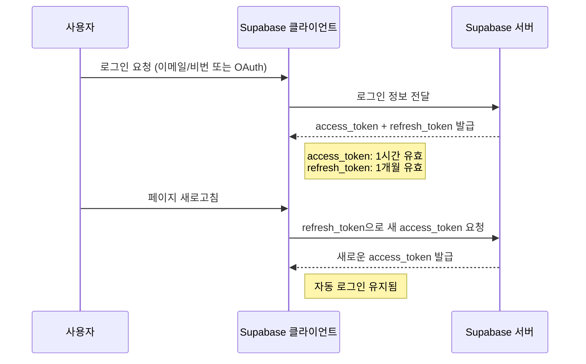

Supabase Auth는 **JWT(JSON Web Token) 기반 인증 시스템**을 사용하여 로그인 유지를 관리한다.

---

### 🔹 Supabase 로그인 유지 방식

1. **액세스 토큰(Access Token)과 리프레시 토큰(Refresh Token) 발급**
    
    - 사용자가 로그인하면 Supabase는 `access_token`과 `refresh_token`을 발급합니다.
    - `access_token`은 인증된 요청을 보낼 때 사용되며, 기본적으로 **1시간 후 만료**됩니다.
    - `refresh_token`은 `access_token`이 만료되었을 때 새 `access_token`을 받아오기 위해 사용됩니다. 기본적으로 **1개월 동안 유효**합니다.
2. **로컬 저장 방식**  
    Supabase 클라이언트(SDK)는 `refresh_token`을 **브라우저의 `IndexedDB`**에 저장하고 관리합니다.
    
    - `localStorage` 또는 `sessionStorage`에 직접 저장하지 않고 `IndexedDB`를 활용해 보안성을 높입니다.
3. **자동 로그인 유지 (세션 복구)**
    
    - 사용자가 페이지를 새로고침하거나 다시 방문하면, Supabase는 `refresh_token`을 이용해 자동으로 새로운 `access_token`을 발급받아 로그인 상태를 유지합니다.
    - Supabase 클라이언트는 `auth.onAuthStateChange`를 사용해 로그인 상태 변화를 감지하고 자동으로 토큰을 갱신합니다.
4. **백그라운드 자동 토큰 갱신**
    
    - Supabase는 `access_token`이 만료되기 약 **30초 전**에 자동으로 `refresh_token`을 사용해 새 `access_token`을 요청합니다.
    - 이를 통해 사용자가 활동 중이라면 로그인 유지가 끊기지 않습니다.

---

### 🔹 로그인 유지 흐름 예시



---

### 🔹 Supabase에서 로그인 상태 확인하는 방법

```ts
import { createClient } from "@supabase/supabase-js";

const supabase = createClient("https://your-project-url.supabase.co", "public-anon-key");

// 현재 로그인 상태 확인
const {
  data: { session },
} = await supabase.auth.getSession();

if (session) {
  console.log("로그인 유지됨 ✅", session.user);
} else {
  console.log("로그인 안 됨 ❌");
}
```

---

### 🔹 자동 로그인 유지가 안 되는 경우

1. **리프레시 토큰 만료 (기본 1개월)**
    
    - `refresh_token`의 기본 유효기간은 1개월이므로, 이 기간이 지나면 자동 로그인 유지가 되지 않음.
    - 해결 방법: 사용자가 직접 재로그인하도록 유도해야 함.
2. **토큰이 삭제되거나 IndexedDB가 비워짐**
    
    - 사용자가 브라우저 데이터를 삭제하면 로그인이 해제됨.
    - 시크릿 모드(Incognito)에서는 `IndexedDB` 저장이 제한될 수도 있음.
3. **서버에서 세션이 만료됨**
    
    - Supabase의 보안 정책에 따라 특정 상황에서는 `refresh_token`이 만료될 수도 있음.

---

### 🔹 수동으로 세션 갱신하는 방법

```ts
await supabase.auth.refreshSession();
```

이 코드를 실행하면 `refresh_token`을 이용해 새로운 `access_token`을 받아올 수 있습니다.

---

### 🔹 요약

✅ Supabase는 `access_token`(1시간)과 `refresh_token`(1개월)을 활용해 로그인 유지  
✅ `refresh_token`은 `IndexedDB`에 저장됨  
✅ 자동으로 만료 전에 `access_token`을 갱신해 로그인 유지  
✅ `refresh_token`이 만료되면 사용자가 다시 로그인해야 함

---
