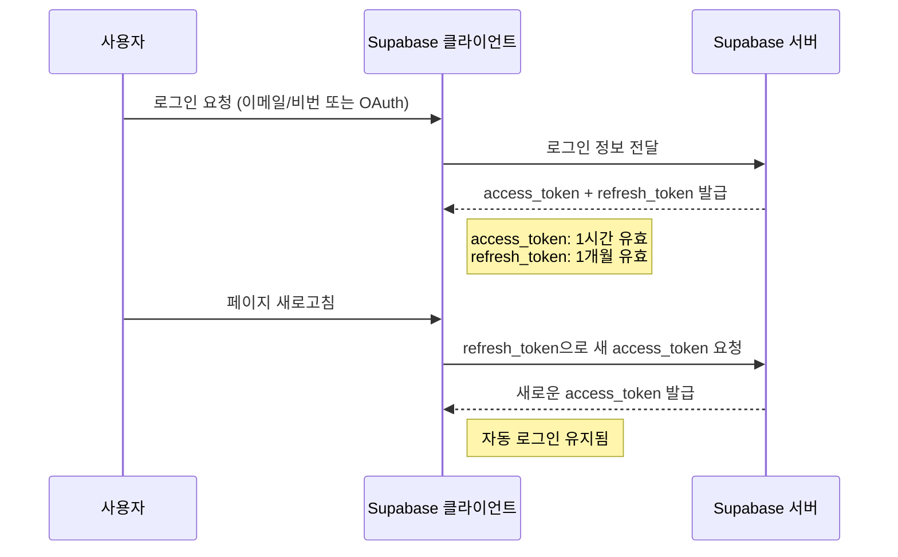

## Supabase의 세션 관리 방식은 뭔가 이상하다?
`supabase`로 프로젝트를 하다 보면  supabase의 세션이 어떻게 돌아가는지 궁금해지는 지점이 온다. 왜냐하면 supabase의 session은 JWT(JSON Web Token)을 이용하기 때문에 일반적으로 우리가 알고 있는 세션의 개념과는 조금 상이하기 때문이다.

대표적인 세션은 일정 시간 동안 같은 사용자(브라우저)로부터 들어오는 일련의 요구를 하나의 상태로 보고, 그 상태를 유지시키는 기술이다.  

> 여기서 일정 시간은 방문자가 웹 브라우저를 통해 웹 서버에 접속한 시점부터 웹 브라우저를 종료하여 연결을 끝내는 시점을 말한다.  

즉, 브라우저가 종료되기 전까지 클라이언트의 요청을 유지하게 해주는 기술을 세션이라고 한다. 이 과정에서 세션을 유지하기 위해 서버는 유저의 정보를 **서버에서 저장하고 있다.** 서버가 돌아가는 동안 연결이 된 유저들을 직접 관리하며, 클라이언트 측에서는 세션 id를 쿠키로 보내주어 해당 id를 받아 유저와의 인증을 구현한다.

하지만 supabase에서 제공하는 세션은 일반적인 세션 유지 방식이 아닌 JWT 방식으로 클라이언트가 정보를 들고 있는 방식인 데다가 추가적으로 sessionId까지 들고 있다. 일반적인 세션과는 사뭇 다른 느낌을 받기 때문에 이에 대해서 이해할 필요성이 있다고 느꼈다.


---
## Supabase 로그인 유지 방식

supabase를 이용하여 로그인을 구현하면 supabase 서버에서는 로그인 정보를 확인하고 일치하는 정보가 있으면 **리프레시 토큰과 액세스 토큰**을 발급한다. 

`access_token`은 인증된 요청을 보낼 때 사용되며, 기본적으로 **5분 ~ 1시간 후 만료**된다. 액세스 토큰의 경우 너무 길게 유효기간을 잡으면 보안상에 위험이 될 수 있으므로 짧게 두고 리프레시 토큰을 통해 새롭게 발급할 수 있도록 한다.

`refresh_token`은 `access_token`이 만료되었을 때 새 `access_token`을 받아오기 위해 사용된다.
 이렇게 토큰을 발급받는 동시에 로그인 시 쿠키에 관련 로그인과 관련된 값들을 쿠키에 저장한다. 서버는 이러한 쿠키에 있는 문자열을 해석하여 토큰을 알아내고, 이를 기반으로 새로고침이 일어나거나 하면 리프레시 토큰으로 새 토큰을 재발급 받아 로그인 상태를 유지시킨다.
 
이 과정에서 Supabase 클라이언트는 `auth.onAuthStateChange`를 사용해 로그인 상태 변화를 감지하고 자동으로 토큰을 갱신하거나, 새로고침을 하는 등의 이벤트를 미리 등록하여 사용할 수도 있다.


### Supabase에서 로그인 상태 확인하는 방법

```ts
import { createClient } from "@supabase/supabase-js";

const supabase = createClient("https://your-project-url.supabase.co", "public-anon-key");

// 현재 로그인 상태 확인
const {
  data: { session },
} = await supabase.auth.getSession();

if (session) {
  console.log("로그인 유지됨 ✅", session.user);
} else {
  console.log("로그인 안 됨 ❌");
}
```

---

### 수동으로 세션 갱신하는 방법

```ts
await supabase.auth.refreshSession();
```

이 코드를 실행하면 `refresh_token`을 이용해 새로운 `access_token`을 받아올 수 있다

---

