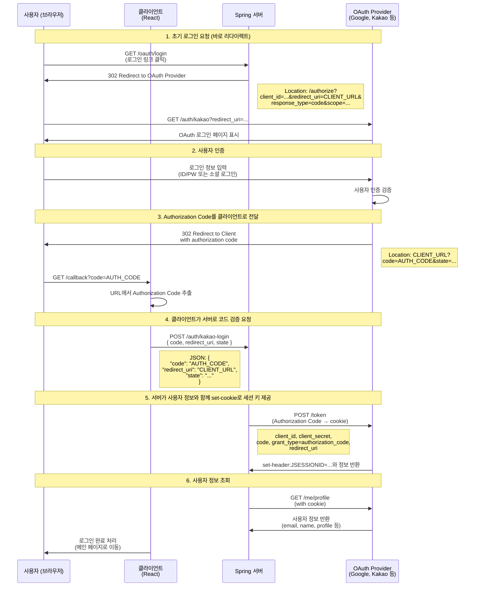

## 들어가며..
백엔드 팀원들이 취업해버렸다.

근데 우리 팀은 백엔드 2명, 프론트 1명(나)로 이루어져 있었는데 백엔드 2명이 둘다 한번에 같은 회사(!!)로 되어버렸다.

그렇게 어쩌다보니 1인 기업이 되어 있었다..(실제 사업자 등록도 해놓음)
이런 상황에서 나는 정면돌파로 풀스택으로 개발하면서 기능을 추가하는 것을 택했고, 이번에 그 첫번째로 애플 로그인을 다룬다.

서버 구성에 대한 상세 설명은 아래에서 볼 수 있다. 
[[마이그레이션을 위한 서버 ADR]]

### 네이티브에서의 로그인 로직
네이티브에서의 로그인 로직은 기존의 웹 로직과는 다소 차이가 있다고 생각한다. 
기존의 웹 Oauth 로그인 방식은

와 같은 구조로 이루어져 있다.

하지만 네이티브 환경에서의 로그인은 조금 달라진다. 네이티브에서는 로그인 페이지로 이동하는 것이 아닌, 네이티브에서의 로그인 환경을 따로 제공해주기 때문에 redirect와 같은 부수적인 과정이 생략되면서 code를 포함한 정보를 얻는 과정이 하나의 screen 내에서 이동 없이 가능하다.


또한 네이티브 환경에서의 애플 로그인의 경우에는 애플 네이티브 로그인 UI가 있기 때문에 처음 개발할 때는 웹뷰로 할 수 있더라도 IOS 로그인 기능을 활용하는 것이 사용자 경험에도 좋을 것이라 판단했다. 대부분 페이스 아이디를 활용해서 간단하게 로그인 하는 것을 선호하기 때문이다.

### 로그인 구현하기(클라이언트)
로그인의 경우는 Npm registry에서 제공하는 `@invertase/react-native-apple-authentication`를 활용했다. 해당 라이브러리의 경우에는 

```tsx
import { appleAuth } from '@invertase/react-native-apple-authentication';
import axios from 'axios';
import {
    auth0Client,
    auth0Domain,
    auth0Audience
} from '../constants/constants';

export default async function AppleAuthentication() {
    return new Promise(async (resolve, reject) => {
        const appleAuthRequestResponse = await appleAuth.performRequest({
            nonceEnabled: false,
            requestedOperation: appleAuth.Operation.LOGIN,
            requestedScopes: [appleAuth.Scope.FULL_NAME, appleAuth.Scope.EMAIL]
        });

        const credentialState = await appleAuth.getCredentialStateForUser(
            appleAuthRequestResponse.user
        );

        if (credentialState === appleAuth.State.AUTHORIZED) {
            const {
                    fullName,
                    authorizationCode,
                    email
                } = appleAuthRequestResponse,
                { familyName, givenName } = fullName;

            await axios({
                url: `https://${auth0Domain}/oauth/token`,
                method: 'POST',
                data: {
                    grant_type:
                        'urn:ietf:params:oauth:grant-type:token-exchange',
                    subject_token_type:
                        'http://auth0.com/oauth/token-type/apple-authz-code',
                    scope:
                        'read:appointments openid profile email email_verified',
                    audience: auth0Audience,
                    subject_token: authorizationCode,
                    client_id: auth0Client,
                    user_profile: JSON.stringify({
                        name: {
                            firstName: givenName,
                            lastName: familyName
                        },
                        email: email
                    })
                }
            })
                .then(async (_auth0Response) => {
                    resolve({
                        message: 'success',
                        ..._auth0Response,
                        first_name: givenName,
                        last_name: familyName
                    });
                })
                .catch((_auth0Error) => {
                    reject({ error: true, message: 'error', detailedInformation: _auth0Error });
                });
        }
    });
}
```