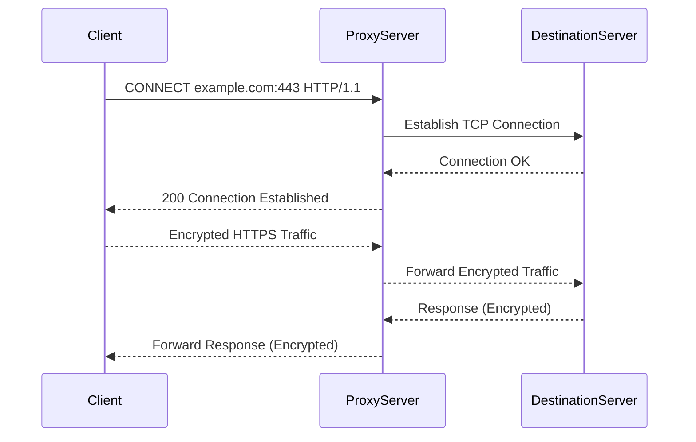
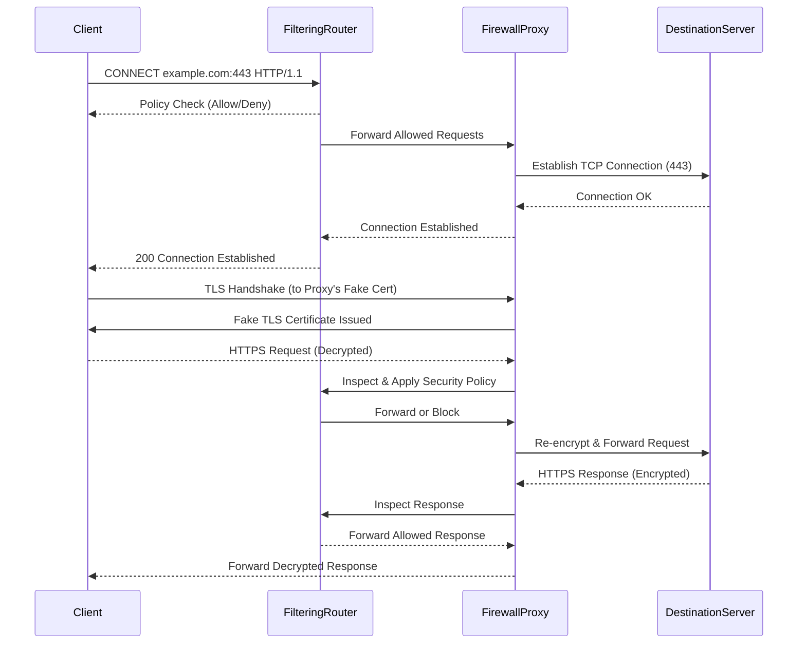

많은 웹 개발자들은 리소스에 대한 프로토콜로 HTTP를 주로 사용한다. 이 리소스는 예전에는 단순 정적인 HTML 정도였지만, 시간이 지나고 기술이 발달하면서 동적으로 생성되는 HTML과 같은 다양한 종류의 리소스에 대해서 HTTP를 통해 콘텐츠에 접근할 수 있도록 하고 싶었다. 그래서 기존의 HTTP 위에 다른 프로토콜을 얹거나, 서로 다른 프로토콜을 상호 운용하는 수단으로도 발전했다. 그렇다면 이러한 HTTP는 어떻게 다른 프로토콜이나 애플리케이션 간 통신에 사용하는 걸까?

## 게이트웨이
기술이 발전함에 따라 웹에는 더 복잡한 리소스를 올려야 할 필요성이 생겼다. 하지만 모든 리소스를 한 개의 애플리케이션으로만 처리하는 것은 점점 어려워졌다.
이를 해결하기 위해 다양한 형태의 리소스를 받기 위한 경로를 안내하는 역할을 하는 게이트웨이가 나오게 되었다.

게이트웨이는 리소스와 애플리케이션을 연결하여 동적인 콘텐츠를 생성하거나 데이터베이스에 질의를 보내는 등 애플리케이션이 보내는 요청에 대해 각각 다른 리소스를 담은 응답을 보내줄 수 있도록 해준다.

게이트웨이는 HTTP 트래픽을 다른 프로토콜로 자동으로 변환하여, HTTP 클라이언트가 다른 프로토콜을 알 필요 없이 서버에 접속할 수 있도록 도와준다. 


이런 식으로 HTTP 요청으로 갔지만, 게이트웨이에서 FTP 프로토콜로 변환하여 FTP 서버와 리소스를 교환한 뒤 응답을 다시 HTTP로 보내주기도 하고, 웹 서버 바로 앞단에 놓아 고성능 암호화 기능을 제공하기도 한다.

>SSL(Secure Sockets Layer)
>보안 소켓 계층 인증서로 브라우저와 서버 사이 암호화된 연결을 수립하는데 사용된다.
>응용 계층과 전송 계층 사이에 존재하는 독립적인 프로토콜 계층이며, 가는 데이터나 오는 데이터 모두 이동하는 과정에서 암호화를 시켜준다

마지막 사진의 경우 HTTP 클라이언트를 서버측 애플리케이션 프로그램에 연결하는 형태이다. 이와 같이 서로 다른 프로토콜이나 프로그램에서도 HTTP를 통해 정보를 교환할 수 있는 방법을 제공한다.

> 위 그림처럼 서로 다른 프로토콜 간 교환이 이루어질 때는 `<클라이언트 프로토콜>/<서버 프로토콜>`의 형태로 기술한다.

여기서 게이트웨이가 가지는 위치에 따라 두 가지로 나누어 구분할 수 있다.
- 서버측 게이트웨이 : 클라이언트와 HTTP로 통신하고, 서버와는 외래 프로토콜로 통신
- 클라이언트측 게이트웨이 : 클라이언트와 외래 프로토콜로 통신하고, 서버와 HTTP로 통신

### 프로토콜 게이트웨이
게이트웨이도 HTTP 트래픽을 보낼 수 있는 만큼, 명시적으로 게이트웨이를 설정하여 트래픽이 게이트웨이를 거쳐 가게 하거나 리버스 프록시로도 사용이 가능하다.

> 리버스 프록시(Reverse Proxy)
> 웹 서버 앞단에 놓인 프록시로, 클라이언트의 접근을 먼저 받아 요청을 웹 서버에 배분해주는 서버 아키텍처
> 서버의 IP주소를 감출 수 있기 때문에 보안상으로 이점을 가지며, SSL 암호화, 캐싱 등 다양한 기능을 제공한다.

그렇다면 위에서 보았던 각 프로토콜별 데이터 교환에 대해서 게이트웨이가 무엇을 하는지 알아보자
#### HTTP/*
각 컴퓨터에서 특정 프로토콜에 대해 프락시로 만들어 놓은 게이트웨이를 설정해놓으면, 일반적인 http 요청은 그대로 가되 ftp 요청에 대해서는 해당 게이트웨이를 향해 먼저 HTTP 요청을 보내게 되고 게이트웨이에서 FTP 서버와 FTP로 요청과 응답을 주고 받은 후에 다시 나에게 HTTP로 돌아오게 된다.


이 과정에서 게이트웨이는 원 서버의 FTP(21 포트)로 FTP 커넥션을 연결하고 FTP 프로토콜을 통해서 객체를 가져온다. 이 과정에서 게이트웨이는
```
USER와 PASS 명령으로 서버에 로그인
-> CWD -> 다운로드 형식 ASCII로 설정 
-> MDTM으로 최근 수정 시간 가져오기 
-> PASV로 서버에 수동형 데이터 검색 
-> RETR로 객체 검색 
-> 제어 채널에서 반환된 포트로 FTP 서버에 데이터 커넥션 
-> 채널이 열리면 객체를 게이트웨이로 전송
```
의 작업을 수행한다.

#### HTTP/HTTPS

HTTP 요청을 받아 HTTPS 요청으로 웹 서버에 요청을 보내는 `서버측 보안 게이트웨이`는 기업 내부의 모든 웹 요청을 암호화하여 보안상의 이점을 가진다.

#### HTTPS/HTTP(클라이언트 측 보안 가속 게이트웨이)

HTTP/HTTPS에 비해 게이트웨이가 더 가까이 있어 캐싱 데이터가 가까운 덕분에 속도가 더 빨라 보안 가속기로 유명하다.
HTTPS로 데이터를 보내면 효율적으로 보안 트래픽을 복호화하는 암호화 하드웨어를 내장에서 원 서버의 부하를 줄여주지만 반대로 아무거나 나 받다가 큰일날 수 있으니 게이트웨이와 원 서버 간의 네트워크가 안전한지 꼭 확인해야 한다.

### 리소스 게이트웨이
네트워크상에서 클라이언트와 서버를 연결하는 게이트웨이도 있지만, 가장 일반적인 형태의 애플리케이션 서버는 목적지 서버와 게이트웨이를 한 개의 서버로 결합한 형태이다.

위에서 한번 넣었던 사진처럼 애플리케이션 서버는 HTTP 클라이언트를 여러 백엔드 애플리케이션으로 연결하는 형태이다.

가장 유명했던 최초의 API는 CGI(Common Gateway Interface)로, 특정 URL에 대한 HTTP 요청에 따라 프로그램 실행 후 출력을 수집해 이를 응답으로 돌려주는 인터페이스 집합이었다.


위와 같은 방식으로 게이트웨이를 통해야 받을 수 있는 리소스 요청에 대해 헬퍼 애플리케이션을 생성하여 요청을 처리하고 서버로 반환하면 서버가 이를 받아 클라이언트로 다시 돌려주는 메커니즘을 가진다. 이러한 방식의 메커니즘은 가장 오래되고 널리쓰이고 있으며, 동적인 HTML 처리나 신용카드 결제, DB 질의와 같은 요청을 처리하는데 사용한다.

이러한 CGI는 사용자에게 보이지 않고 내부적으로 처리하는 과정을 다룰 수 있어 보안상으로 이점을 가지지만, 하나의 CGI 요청마다 하나의 프로세스를 만들어서 처리해야 하는 만큼 서버의 부담이 크다. 느리기도 느리고 메모리도 많이 잡아 먹는다. 이를 해결하고자 Fast CGI가 개발되어 데몬으로 동장함으로써 프로세스 생성 제거 반복 과정에서의 성능 저하 문제를 해결하였다.

CGI 프로토콜은 이렇게 구동 중인 HTTP 서버에 외부 인터프리터가 쉽게 접속할 수 있게는 해주지만 이 CGI의 성능을 올리거나 동작을 바꾸려면 어떻게 해야 할까?
바로 모듈을 직접 HTTP와 연결하는 **서버 확장 API** 방식이 있다. 해당 방식으로 코드를 서버에 연결하거나 컴포넌트를 내가 만든걸로 바꿔낄 수 있게 했다. 한마디로 프론트에서 RPC(Remote Procedure Call)명령을 해서 HTTP에 요청이 편승하여 오게 하도록 했다.

## 애플리케이션 인터페이스와 웹 서비스
이렇게 애플리케이션을 HTTP를 통해 연결시키면서 까다로운 이슈가 하나 생겼는데, 데이터를 교환하는 두 애플리케이션 사이에서 프로토콜 인터페이스를 맞추는 일이다. 

이를 위해 각 웹 애플리케이션이 서로 통신하는데 사용할 표준과 프로토콜 집합을 개발하였고, 이를 웹 서비스라고 부르게 되었다. 

>원래도 웹서비스는 독립형 웹 애플리케이션이라는 의미도 있지만 추가되었다.

이러한 웹 서비스는 SOAP를 통해 XML을 사용하여 정보를 교환한다. 

> SOAP(Simple Object Access Protocol)
> HTTP 메시지에 XML 데이터를 담는 방식에 대한 표준

>XML(eXtensible Markup Language)
>데이터 객체를 담는 데이터를 생성하고 해석하는 방식을 제공하는 마크업 언어

## 터널
게이트웨이를 통해 리소스에 접근하거나 애플리케이션간 통신에 HTTP를 사용하는 여러 방법도 있지만, HTTP를 사용하는 방식 중에 HTTP 프로토콜을 지원하지 않는 애플리케이션에 HTTP 애플리케이션을 사용해 접근하는 방법도 있다. 이를 **터널** 이라고 한다.

웹 터널을 사용하면 HTTP 커넥션을 통해서 HTTP가 아닌 트래픽을 전송하거나 다른 프로토콜을 HTTP 위에 올리는 것 또한 가능하다.
>주로 웹 터널은 HTTP 커넥션 안에 HTTP가 아닌 트래픽을 얹기 위해 쓴다

웹 터널은 HTTP의 CONNECT 메서드를 사용하여 커넥션을 맺고 게이트웨이(혹은 프록시 서버)는 이러한 CONNECT 메서드를 받아 TCP 커넥션을 연 다음 TCP 커넥션을 통해 데이터를 HTTP로 전달하고 게이트웨이를 통해 HTTP로 다시 응답을 받는다.

이러한 방식은 HTTP로 접근 할 수 없는 기업 환경과 같은 곳에서 보안을 지키면서도 내부 리소스에 접근할 수 있는 방법이 된다.



하지만 이 과정에서 터널을 통해 전달되는 데이터는 게이트웨이에서 볼 수 없기 때문에 패킷의 순서나 흐름에 대한 가정을 할 수 없다는 것이 단점이다.

추가적으로 이 과정에서는 클라이언트가 CONNECT 요청을 보내고 응답 전 바로 터널 데이터를 전송함으로써 성능을 높일 수 있지만 게이트웨이가 이를 처리하지 못하면 말짱 도루묵이므로 게이트웨이의 설정이 중요하다.

이 과정에서 중간에 터널이 끊어지거나 하면 데이터가 가다가 반대편으로 다시 전달되고 전송하지 않은 데이터는 버려진다.

#### SSL 터널링
웹 터널은 방화벽을 통해 암호화된 SSL 트래픽을 전달하려고 개발되었다.
허용된 트래픽에 대해서만 연결을 방화벽으로 전달하기 때문에 보다 강력한 보안이 가능하다.


SSL 트래픽은 일반적으로 HTTPS(443 포트)로 전송되며, 프록시 서버를 통과할 때 **CONNECT 메서드를 이용한 SSL 터널링**이 사용된다.

일반적인 프록시 서버는 HTTPS 요청을 해석할 수 없지만, SSL 터널링을 사용하면 클라이언트가 생성한 **암호화된 SSL 세션을 프록시 서버를 거쳐 목적지 웹 서버로 그대로 전달**할 수 있다.

SSL 트래픽을 **프록시가 가로채서 복호화한 후 HTTP로 클라이언트에게 전달하는 방식(SSL 가로채기, SSL Interception)** 도 존재하지만, 이 방식은
- **프록시가 인증을 담당하여 클라이언트가 원격 서버에 직접 SSL 클라이언트 인증을 수행할 수 없음**
- **SSL 가로채기를 위해 프록시가 자체 인증서를 사용하므로, 신뢰할 수 없는 환경에서는 보안 위험이 존재한다.** 자칫하면 중간에 있는 프록시가 아닌 정보를 탈취하려는 공격자가 이 사이에 끼어서 인증서를 보내줌으로써 정보를 탈취할 수도 있기 때문이다. 이를 중간자 공격(MITM, Man In the Middle Attack) 이라고 한다.
- **게이트웨이가 반드시 SSL 복호화 기능을 지원해야 하며, TLS 상호 인증이 필요한 경우 문제가 발생할 수 있음**  
등의 단점이 있다.

따라서, **SSL 터널링을 사용하면 클라이언트가 원격 서버와 직접 SSL 세션을 설정할 수 있으며, 프록시 서버는 트랜잭션의 내용을 복호화하지 않고 암호화된 상태 그대로 전달하는 역할만 수행하게 된다.**

#### 터널 인증
HTTP는 터널과 함께 사용함으로써 프락시 인증을 구현할 수도 있다. 인증 없이 `CONNECT` 요청을 클라이언트에서 전송하면 게이트웨이에서 사용 허가를 내기 전에 인증 요구를 하게 되고, 인증과 함께 CONNECT 요청을 보내게 되면 그 때서야 게이트웨이가 TCP 커넥션을 열면서 커넥션을 통해 터널로 데이터를 받을 수 있다.


#### 터널 보안
터널 게이트웨이는 통신하고 있는 프로토콜이 터널을 올바르게 사용하고 있는지 검증할 방법이 없기 때문에 443과 같은 전용 포트만을 터널링 할 수 있도록 해야 한다.

## 릴레이
HTTP 릴레이는 HTTP 명세를 완전히 준수하지는 않는 간단한 HTTP 프락시이다.
헤더와 메서드 로직 등 복잡한 HTTP 로직을 수행하지 않고 맹목적으로 트래픽을 전달하는 방법으로, 일단은 중간서버 역할을 한다. 단순 필터링이나 진단 혹은 콘텐츠 변환 등에 사용되기도 하고 부하 분산같은 역할을 하기도 한다.

하지만 HTTP 로직 없이 맹목적으로 트래픽을 전달하는 만큼, 잠재적으로 상호 운용 문제를 가지고 있다는 의미기 때문에 주의해서 배포해야 한다. Connection 헤더가 제대로 처리되지 않는 경우 keep-alive 커넥션이 행(hang)에 걸리는 문제도 있다.

행(hang)문제의 경우 릴레이가 Connection 헤더를 이해 못하기 때문에 홉 사이에서만 사용하는 헤더가 서버까지 넘어가게 되는 현상이다.
이 문제의 경우 클라이언트는 릴레이와 keep-alive 되어있다고 생각하고, 서버는 릴레이와 keep-alive 되어있다고 생각하기 때문에 릴레이와 맺고있는 각 커넥션은 계속 유지가 되면서도 같은 커넥션으로 또 다른 요청이 오는 것을 예측하지 못해 작업을 진행하지 못하는 문제이다.
멍청한 프락시와 비슷한 느낌이랄까..


이러한 문제가 있는 만큼 HTTP 명세를 준수하는 프락시를 사용하는게 좋다.

