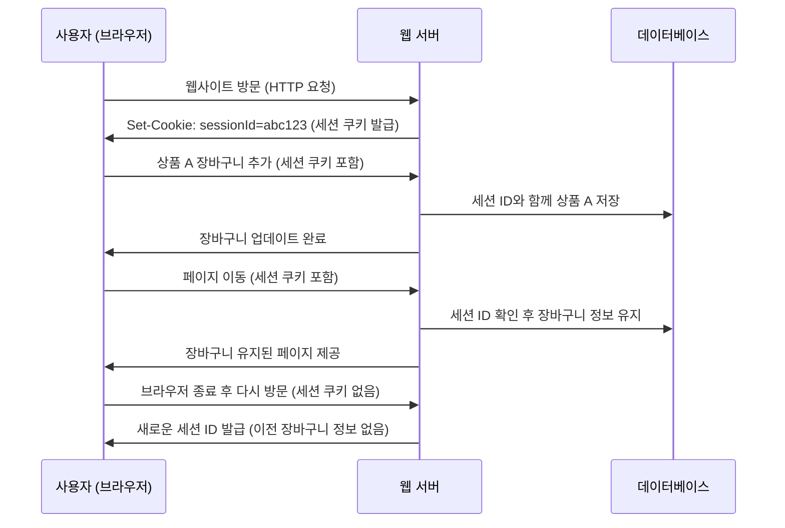

HTTP는 기본적으로 **무상태성(Stateless)** 을 지닌다. 이는 곧 서버가 사용자를 모른다는 뜻인데, 그럼 매번 요청과 응답을 주고받는 과정에서 서버는 요청을 보낸 사용자를 식별해야 하는 경우는 다양하다. 온라인 쇼핑몰에서 사용자에게 맞춤 상품 추천을 한다거나, 저장된 사용자 정보를 가져와 빠르게 결제를 할 수 있도록 하고, 각 사용자에게 특화된 서비스를 많이 제공한다.
하지만 이렇게 HTTP 트랜잭션이 상태가  없는 만큼, 이러한 HTTP 트랜잭션을 식별할 수 있는 다른 방법이 필요하다. 

## HTTP 헤더
HTTP 헤더는 생각보다 다양한 정보를 많이 넣을 수 있다. 

| 헤더 이름         | 헤더 타입  | 설명                                                                   |
| ------------- | ------ | -------------------------------------------------------------------- |
| From          | 요청     | 사용자의 이메일 주소<br>웹 로봇이 문제를 일으켰을 때 이메일로 연락할 수 있도록 기입해둬야 한다.             |
| User-Agent    | 요청     | 사용자의 브라우저 이름, 버전 정보, 운영체제 정보 등<br>특정 브라우저나 운영체제 등에 맞춘 콘텐츠 최적화에 사용한다. |
| Referer       | 요청     | 사용자가 현재 링크를 타고 온 근원 페이지<br>현재 페이지로 유입하게 한 웹페이지의 URL                  |
| Authorization | 요청     | 사용자 이름과 비밀번호<br>주로 인증에 사용된다                                          |
| Client-ip     | 확장(요청) | 클라이언트의 IP 주소<br>                                                     |
| X-Forward-For | 확장(요청) | 클라이언트의 IP주소                                                          |
| Cookie        | 확장(요청) | 서버가 생성한 ID fkqpf                                                     |

## 클라이언트 IP 주소
클라이언트 IP 주소는 HTTP 표준이 아니기에 헤더에는 많이 없다. 하지만 이를 알아내기 위해서는 웹 서버가 HTTP 요청을 보내는 반대쪽 TCP 커넥션의 IP 주소를 알아낼 수 있다. 하지만 이를 통해 사용자를 구별한다? 이 부분은 살짝 취약점이 있다.

- 같은 컴퓨터를 여러명이서 돌려 쓰면 식별 불가
- 인터넷 서비스 제공자(ISP)는 동적IP 할당으로 다른 주소를 받을 수 있음
- 네트워크 주소 변환(Network Address Translation, NAT) 방화벽을 사용하면 통일된 방화벽 IP주소로 변환됨
- 웹 서버는 클라이언트의 IP 주소 대신 앞단에 놓인 프락시나 게이트웨이의 IP를 보고있음

이러한 이유 때문에 클라이언트 IP 주소를 사용하는 방식은 오늘날 거의 사용되지 않는다.

## 사용자 로그인
명시적으로 로그인을 통해 식별할 수 있는 수단을 마련하는 방식이다. 주로 `WWW-Authenticate`와 `Authorization` 헤더를 통해 인증을 구현한다. 


이런 식으로 로그인이 필요한 정보에 접근하기 위해서는 WWW-Authenticate 헤더를 통해 로그인 대화상자를 열 수 있고, 로그인한 후에는 계속해서 사용자의 정보를 토큰의 형태로 저장한 다음, `Authorization` 에 받은 토큰을 그대로 넘기면 한 세션이 진행되는 동안 사용자에 대한 식별을 유지할 수 있다.

하지만 웹 사이트 로그인은 귀찮은 만큼 각 사이트에 로그인을 하고 이를 기억하기 위해서는 유니크한 값을 가져야 하는데, 많은 웹사이트를 모두 기억해야 한다는 점이다. 이를 보완하기 위해 뚱뚱한 URL이라는 방법이 나왔다.
## 뚱뚱한 URL
뚱뚱한 URL은 사용자의 상태 정보를 포함하고 있는 URL을 의미한다. URL이 뚱뚱하다고 말한 이유는 진짜 리터럴리 URL이 뚱뚱하기 때문이다.

이런 식으로 동적으로 만든 사용자의 상태 정보(식별 번호 등)를 URL에 넣어서 하이퍼링크 등을 생성하면 이를 보고 서버가 사용자를 추적한다. 하지만 이러한 방식에도 문제는 있다.
- URL이 못생겨짐
- URL 공유 못함. 공유하게 되면 내 개인정보가 같이 간다
- 동적으로 URL을 생성하고 HTML 템플릿을 만들어야 하는 만큼 서버 부하가 있을 수 있다
- URL이 매번 달라지기 때문에 캐싱을 활용할 수 없다
- 웹사이트가 아닌 특정 URL을 요청하거나 할 때 의도치 않게 해당 사이트에서 이탈하기 쉽다
- 로그아웃하면 모든 정보를 잃는다

## 쿠키
서버가 사용자의 웹 브라우저에 저장하는 작은 데이터 조각이다. 현재까지도 가장 널리 사용하는 방식이다. 
브라우저는 데이터 조각들을 브라우저에 저장해놓고 있다가, HTTP 요청이 일어나면 해당 사이트에 가지고 있는 쿠키를 끌고 와서 함께 요청에 넣어 보낸다. 
### 쿠키의 타입
예전에 쿠키는 크게 세션 쿠키와 지속 쿠키정도로 나누었지만, 요즘은 그 종류가 매우 다양해졌다.

#### 세션 쿠키 (Session Cookie)
- 브라우저를 닫으면 자동으로 삭제되는 쿠키.
- 사용자 로그인 상태 유지 같은 용도로 사용됨.
- `Expires` 또는 `Max-Age` 속성이 없거나 `0`이면 세션 쿠키로 동작.
    
#### 지속 쿠키 (Persistent Cookie)
- 특정 기간 동안 저장되는 쿠키로, 브라우저를 닫아도 유지됨.
- `Expires` 또는 `Max-Age` 속성이 지정되어 있음.
- `Discard` 파라미터가 설정으로 세션 쿠키를 만들 수도 있음
- 자동 로그인, 장바구니 유지 같은 기능에 사용됨.
    
#### 퍼스트 파티 쿠키 (First-Party Cookie)
- 사용자가 방문한 웹사이트 도메인에서 직접 설정한 쿠키.
- `example.com`에서 생성한 쿠키는 `example.com`에서만 접근 가능.
- 로그인 정보 유지, 사이트 설정 저장 등에 사용됨.
    
#### 서드 파티 쿠키 (Third-Party Cookie) & 트래킹 쿠키
- 방문한 사이트가 아닌 다른 도메인에서 생성한 쿠키.
- 광고, 트래킹 서비스(예: Google Analytics, Facebook Pixel).
- 개인 정보 보호 문제로 인해 많은 브라우저에서 차단하는 추세.
    
#### 보안 쿠키 (Secure Cookie)
- `Secure` 속성이 설정된 쿠키로, HTTPS 연결에서만 전송됨.
- HTTP 연결에서는 노출되지 않아 데이터 유출 위험이 줄어듦.
    
#### HttpOnly 쿠키
- `HttpOnly` 속성이 설정된 쿠키는 JavaScript에서 접근할 수 없음.
- XSS(크로스 사이트 스크립팅) 공격을 방지하는 데 유용함.
    
#### SameSite 쿠키
- `SameSite` 속성으로 CSRF(사이트 간 요청 위조) 공격을 방지할 수 있음.
- 옵션:
    - `Strict` → 동일 사이트에서만 쿠키 전송 (외부 사이트 링크 클릭 시 쿠키 미전송).
    - `Lax` → 기본값, 안전한 경우(예: GET 요청) 동일 사이트가 아닌 경우에도 쿠키 전송 가능.
    - `None` → 모든 요청에서 쿠키 전송 (단, `Secure` 속성이 필요함).


### 쿠키는 어떻게 동작하는가
쿠키는 서버가 사용자가 들어오면 해당 사용자에게 일종의 스티커를 붙여준다. 해당 스티커는 떼지지 않는 이상(지속 쿠키) 웹 사이트는 계속해서 해당 스티커를 보면서 사용자를 식별할 수 있다.
쿠키는 이름=값 쌍을 가지고 있으며, HTTP 응답 헤더에 Set-Cookie와 같이 기술하여 설정할 수 있다.

HTTP 응답이 왔을 때, `Set-Cookie`가 기술되어 있으면 브라우저는 이를 보고 브라우저 쿠키 데이터베이스에 저장한다.


그렇기 때문에 브라우저는 쿠키 정보를 저장할 책임이 있는데, 이 시스템을 **HTTP 상태 관리 체계(HTTP State Management Mechanism)** 이라고 한다. 


각각의 브라우저가 쿠키를 저장하는 방식은 다르다. 가장 유명한 크롬의 경우 Cookies라는 `SQlite` 파일에 쿠키를 저장한다.
해당 쿠키에 대한 정보중에는 
- creation_utc : 생성 시점
- host_key : 쿠키의 도메인
- name : 쿠키의 이름
- value : 쿠키의 값
- path : 쿠키와 관련된 도메인에 있는 경로
- expire_utc : 쿠키의 파기 시점
- secure : SSL커넥션일 때만 전송
등의 정보를 가지고 있다.

이 쿠키에 대한 정보는 각 도메인마다 구분되어 있으며, 쿠키를 생성한 서버에게만 쿠키에 담긴 정보를 전달한다. 
하지만 쿠키를 생성한 서버에서만 쿠키에 담긴 정보를 전달할 수 있는 만큼, 광고같은 경우는 이러한 쿠키 정책을 이용한 광고 생성 방식을 사용한다. 이러한 광고의 경우엔 해당 서비스의 도메인이 아니기 때문에 다른 광고업체의 도메인에서 만든 쿠키를 보내고 받는 방식인 `서드 파티 쿠키`를 이용한다.

 `서드 파티 쿠키`의 경우에는 `iframe` 태그를 통해 클라이언트에서 해당 사이트에 대해 쿠키를 보내고 받는 방식으로 동작한다. `iframe`을 넣게 되면 해당 도메인 뿐만 아니라 다른 웹사이트까지도 해당 사이트 안에 넣는 것이기 때문에 해당 사이트에서 다른 도메인의 쿠키 또한 보내고 받을 수 있는 것이다. 이는 HTTP 요청 헤더의 `Referer` 헤더를 통해서도 이러한 사용자의 선호도를 측정하는데 도움이 될 수 있어 클라이언트 식별에 사용되는 정보를 수집하기도 한다. 이렇게 같은 광고 업체에서 쿠키를 주고 받으면서 사용자의 선호하는 제품 등의 정보를 수집하고, 이를 쿠키에서 받아와 맞춤 광고를 띄워주는 방식이다.  
 


### 쿠키 Domain 속성
서버는 쿠키를 생성하는 과정에서 `Set-Cookie` 응답 헤더에 `Domain` 속성을 기술해서 어떤 사이트가 그 쿠키를 읽을 수 있는지 제어할 수 있다.

```
Set-cookie: user="minhyung"; domain="mhblog.com"
```
이렇게 쿠키를 설정하면 키, 값 쌍의 데이터를 설정한 도메인인 `.mhblog.com` 의 도메인을 가지고 있는 모든 사이트에 전달한다. 하지만 단점으로는 해당 도메인을 가지고 있는 모든 서브도메인에도 똑같이 쿠키가 간다는 점이다.

이게 뭐가 문제인지 이해가 안 갈 수도 있는데, 최근에 가졌던 한 도메인에 대한 경험을 빗대 보면 이해가 잘 되었다. 
우리 학교는 온라인 강의를 제공하는데, 온라인 강의에 대해 자막 수정이나 관리같은 작업을 할 수 있는 어드민 페이지가 따로 있다. 나는 조교로 해당 온라인 강의의 자막 검수를 종종 맡았는데, 여기서 로그인 할 때마다 이클래스의 도메인과 해당 어드민 페이지의 도메인이 같아 이클래스에서 로그인 하고 어드민 페이지에서 어드민 계정으로 로그인 하게 되면 한쪽에서 다른 곳에서 로그인이 되면서 쿠키가 바뀌어 자막이 편집하다 멈추는 일이 발생했다. 이처럼 같은 모든 도메인에 대해서도 무조건적으로 쿠키를 보내는 것은 예상치 못한 오류를 발생시킬 가능성이 있다.
따라서 무조건 도메인을 기술하는 것이 `silver Bullet` 은 아니라고 생각한다. 필요할 경우 `domain` 을 생략하여 쿠키를 설정하는 서버의 도메인에서만 작동될 수 있게 하는 것도 방법이라고 생각한다.

### 쿠키 Path 설정
쿠키에 `Path` 속성을 설정하면, 해당 경로에 속하는 페이지만 쿠키를 전달할 수 있는 기능 또한 있다. 
```
Set-Cookie: myCookie=value; Path=/
```
 `Path`를 따로 생성하지 않은 경우라면 `Set-Cookie`를 호출한 요청의 **경로를 자동으로 Path 값으로 설정**한다.

### 쿠키 구성요소
옛날에 사용했던 쿠키로는 기본적으로 Version 0 쿠키(넷스케이프 쿠키라고도 한다)와 이의 확장인 Version 1 쿠키(RFC 2965)가 있다.
현재 웹에서 사용되는 쿠키의 명세는 **RFC 6265**(HTTP State Management Mechanism)로, 이전 쿠키 명세는 전부 `deprecated`된 상태이다. 따라서 해당 책에 기재된 쿠키의 명세를 따르기보단 현재 사용중인 쿠키를 중심으로 설명할 예정이다.

[RFC 6265는 여기서 볼 수 있다](https://datatracker.ietf.org/doc/html/rfc6265)

```
set-cookie-header = "Set-Cookie:" SP set-cookie-string
 set-cookie-string = cookie-pair *( ";" SP cookie-av )
 cookie-pair       = cookie-name "=" cookie-value
 cookie-name       = token
 cookie-value      = *cookie-octet / ( DQUOTE *cookie-octet DQUOTE )
 cookie-octet      = %x21 / %x23-2B / %x2D-3A / %x3C-5B / %x5D-7E
                       ; US-ASCII characters excluding CTLs,
                       ; whitespace DQUOTE, comma, semicolon,
                       ; and backslash
 token             = <token, defined in [[RFC2616], Section 2.2](https://datatracker.ietf.org/doc/html/rfc2616#section-2.2)>

 cookie-av         = expires-av / max-age-av / domain-av /
                     path-av / secure-av / httponly-av /
                     extension-av
 expires-av        = "Expires=" sane-cookie-date
 sane-cookie-date  = <[rfc1123](https://datatracker.ietf.org/doc/html/rfc1123)-date, defined in [[RFC2616], Section 3.3.1](https://datatracker.ietf.org/doc/html/rfc2616#section-3.3.1)>
 max-age-av        = "Max-Age=" non-zero-digit *DIGIT
                       ; In practice, both expires-av and max-age-av
                       ; are limited to dates representable by the
                       ; user agent.
 non-zero-digit    = %x31-39
                       ; digits 1 through 9
 domain-av         = "Domain=" domain-value
 domain-value      = <subdomain>
                       ; defined in [[RFC1034], Section 3.5](https://datatracker.ietf.org/doc/html/rfc1034#section-3.5), as
                       ; enhanced by [[RFC1123], Section 2.1](https://datatracker.ietf.org/doc/html/rfc1123#section-2.1)
 path-av           = "Path=" path-value
 path-value        = <any CHAR except CTLs or ";">
 secure-av         = "Secure"
 httponly-av       = "HttpOnly"
 extension-av      = <any CHAR except CTLs or ";">
```
해당 부분은 RFC 6265에 기재된 내용이다.
막상 내용이 많아 어떻게 `Set-Cookie` 를 할지 감이 안 잡힐 수도 있겠지만, 원래 쿠키를 설정하던 것처럼 `Set-Cookie: name=value; Expires=...; Max-Age=...; Domain=...; Path=...; Secure; HttpOnly` 의 형태로 작성하면 된다.

>주의 할 점
>쿠키는 하나의 헤더 필드에 하나만 넣을 수 있다. 여러 개의 쿠키를 설정하고 싶으면 여러 Set-Cookie 헤더를 사용하자.
>그렇지 않다면 Expires를 설정할 때 사용하는 쉼표(,)에 의해 여러가지 충돌이 날 가능성이 있다고 한다.

| Cookie Semantics | 설명                                                                                                                                                                                                                                                                                                                                                                                                                                                                                                                                                                                                                              |
| ---------------- | ------------------------------------------------------------------------------------------------------------------------------------------------------------------------------------------------------------------------------------------------------------------------------------------------------------------------------------------------------------------------------------------------------------------------------------------------------------------------------------------------------------------------------------------------------------------------------------------------------------------------------- |
| Expires          | 쿠키의 만료기한<br>날짜와 시간으로 정할 수 있다.<br>클라이언트에서는 만료 기한이 지나면 브라우                                                                                                                                                                                                                                                                                                                                                                                                                                                                                                                                                                        |
| Max-Age          | 쿠키의 수명을 초 단위로 지정<br>Expires나 Max-Age 속성을 들고 있으면 세션 쿠키가 되고, 두개 동시에 동시에 들고 있다면 M                                                                                                                                                                                                                                                                                                                                                                                                                                                                                                                                                  |
| Domain           | 특정                                                                                                                                                                                                                                                                                                                                                                                                                                                                                                                                                                                                                              |
| Path             | 특정 Path에서만 쿠키를 포함시                                                                                                                                                                                                                                                                                                                                                                                                                                                                                                                                                                                                              |
| Secure           | Secure Connection에만 쿠키를 포함시킨다. 즉, HTTPS 요청에만 포함된다.<br>                                                                                                                                                                                                                                                                                                                                                                                                                                                                                                                                                                          |
| HttpOnly         | 쿠키의 사용범위를 HTTP요청에만 국한시킨다.<br>이는 즉 자바스크립트로 쿠키에 접근하는 것 자체를 막는 것으로, 클라이언트에서 아예 쿠키의 값에 접근할 수                                                                                                                                                                                    RFC6265의 공식적인 명세엔 없지만, 구글이 낸 [RFC-6265bis](https://datatracker.ietf.org/doc/html/draft-ietf-httpbis-cookie-same-site-00)에 명시되어 있다.현재는 대부분의 브라우저에서 모두 지원한다.<br>Strict : 같은 도메인에서만 접근 가능<br>Lax : a tag, link tag 같은 곳을 통해 이동했을 때만 쿠키가 전송됨<br>None: cross-site에서도 쿠키 전송 가능하지만 Secure 옵션을 추가해야 함  전송 가능,  ite에서도   tag 같은  ink tag  r>Lax :  같은 도메인에 |
### 쿠키와 세션 추적
쿠키는 웹사이트에 수차례 트랜잭션을 만들어내는 사용자를 추적하는데 사용한다. 쿠키를 통해 이러한 사용자를 추적하는데 가장 대표적인 예는 쇼핑이다.


1. 사용자가 웹사이트 방문
    - 사용자가 쇼핑 웹사이트에 접속하면 서버는 세션을 생성하고 `Set-Cookie` 헤더로 세션 쿠키를 브라우저에 전달.
    - 이 때, 생성되는 세션의 경우는 회원이 아닌 비회원 또한 마찬가지로 적용됨
2. 사용자가 상품을 장바구니에 추가
    - 브라우저는 요청을 보낼 때 세션 쿠키를 포함.
    - 서버는 세션 정보에 상품 데이터를 저장.
3. 사용자가 페이지를 이동해도 장바구니 유지
    - 같은 세션 쿠키를 계속 포함하여 요청을 보내므로, 서버는 장바구니 정보를 유지.
4. 사용자가 브라우저를 닫으면 세션 종료
    - 세션 쿠키는 `Expires` 또는 `Max-Age`가 없기 때문에 브라우저를 닫으면 자동 삭제.
    - 따라서 장바구니 정보도 사라짐.

### 쿠키와 캐싱
쿠키 트랜잭션과 관련된 문서를 캐싱할 때는 이전 사용자의 쿠키가 다른 사용자에게 할당되거나 개인정보가 노출되는 최악의 상황도 있으므로 주의해야 한다. 이에 대한 명확한 규정은 없지만, 캐시를 다루는 기본 원칙을 지켜야 할 필요성이 있다.

#### 캐시되지 말아야 할 문서 표시
문서가 Set-Cookie 헤더를 제외하고 캐시를 해도 될 경우라면 문서에 명시적으로 `Cache-Control: no-cache="Set-Cookie"` 를 통해 명확히 표시하고, 캐시를 해도 되는 문서에는 `Cache-Control: public`을 사용해서 웹의 대역폭을 절약시키자.

#### Set-Cookie 헤더를 캐시하는 것에 유의하기
응답이 `Set-Cookie` 헤더를 가지고 있으면 본문은 캐시할 수 있지만 `Set-Cookie` 헤더를 캐시하는 것은 여러 사용자에게 같은 `Set-Cookie`를 보내게 되면, 잘못해서 인증을 위해 보내는 쿠키가 캐시되어 다른 사용자에게 가면서 대참사가 일어날 수 있기 때문에 주의해야 한다.

그렇다고 응답을 저장하기 전에 `Set-Cookie` 헤더를 제거하면 `Set-Cookie` 헤더 정보가 없는 데이터를 받게 되는 페이지가 쿠키에 의존하고 있다면 문제가 발생할 수 있다.

이러한 문제는 캐시가 모든 요청마다 원 서버와 재검사시켜 클라이언트로 가는 응답에 Set-Cookie 헤더 값을 기술해서 개선할 수 있다. `Cache-Control: must-revalidate, max-age=0` 으로 무조건 재검사를 시키도록 하자.

#### Cookie 헤더를 가지고 있는 요청 주의하기
위에서 말했던 것처럼 요청이 쿠키 헤더와 함께 오면 결과 콘텐츠가 개인정보를 담고 있을 수도 있다는 문제가 있다. 
보수적인 캐시를 사용하여 Cookie 헤더가 포함된 요청에 응답으로 오는 문서는 캐시하지 않도록 하자. 베스트는 위에서 말했던 것처럼 서버에서 재검사를 하도록 하는 것이다.

### 쿠키, 보안 그리고 개인정보
원격 db에 개인정보를 저장하고 해당 데이터의 키값을 쿠키에 저장하는 방식을 표준으로 사용하면, 어차피 db에 직접적으로 접근하는 방법은 없으므로 클라이언트와 서버 사이에 예민한 데이터가 오가는 것을 줄일 수 있다.

또한 쿠키를 통해서 사용자 추적을 할 수 있는 만큼, 잘못된 의도로 사용되지 않도록 항상 주의하자. 사용자 행동 패턴을 기록하는 것도 중요한 개인정보이니 꼭 동의 받기!(최근에 이거 그냥 수집했다가 기술면접에서 털린 분을 본 적이 있다...)